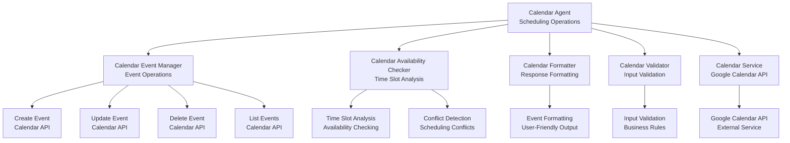
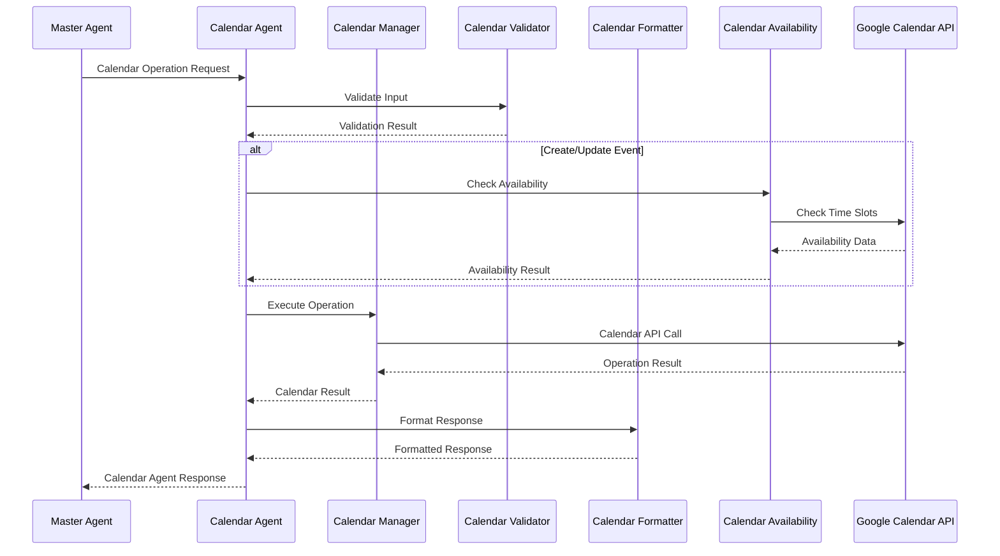

# Calendar Agent

The **Calendar Agent** handles Google Calendar operations and scheduling with AI-powered planning and intelligent event management. This document details the Calendar Agent's architecture, capabilities, and integration patterns.

## 📅 **Calendar Agent Architecture**

The Calendar Agent provides comprehensive calendar management capabilities through Google Calendar API integration with intelligent event handling and scheduling optimization.

### **Calendar Agent Components**



### **Calendar Agent Processing Flow**



## 🎯 **Calendar Agent Capabilities**

### **Core Calendar Operations**

The Calendar Agent supports comprehensive calendar operations:

```typescript
export class CalendarAgent extends AIAgent<CalendarParams, CalendarResult> {
  
  protected async processQuery(params: CalendarParams): Promise<CalendarResult> {
    // AI-powered calendar operation planning
    const plan = await this.generateExecutionPlan(params);
    
    // Execute calendar operations
    const results = await this.executePlan(plan);
    
    // Format and return results
    return this.formatCalendarResults(results);
  }
  
  // Calendar operation methods
  async createEvent(params: CreateEventParams): Promise<CalendarResult> {
    const { title, startTime, endTime, attendees, description, location } = params;
    
    // Validate event parameters
    const validation = await this.validateEventParams(params);
    if (!validation.isValid) {
      throw new Error(`Event validation failed: ${validation.errors.join(', ')}`);
    }
    
    // Check for conflicts
    const conflicts = await this.checkConflicts(params);
    if (conflicts.length > 0) {
      return {
        success: false,
        message: `Scheduling conflicts detected: ${conflicts.map(c => c.title).join(', ')}`,
        data: { conflicts },
        metadata: {
          operation: 'create',
          hasConflicts: true,
          conflictCount: conflicts.length
        }
      };
    }
    
    // Create event via Calendar API
    const result = await this.calendarEventManager.createEvent(params);
    
    return {
      success: true,
      message: `Event "${title}" created successfully`,
      data: result,
      metadata: {
        operation: 'create',
        eventId: result.id,
        attendeeCount: attendees?.length || 0,
        hasLocation: !!location
      }
    };
  }
  
  async updateEvent(params: UpdateEventParams): Promise<CalendarResult> {
    const { eventId, updates } = params;
    
    // Validate update parameters
    const validation = await this.validateUpdateParams(params);
    if (!validation.isValid) {
      throw new Error(`Update validation failed: ${validation.errors.join(', ')}`);
    }
    
    // Check for conflicts if time is being updated
    if (updates.startTime || updates.endTime) {
      const conflicts = await this.checkConflicts({ ...updates, eventId });
      if (conflicts.length > 0) {
        return {
          success: false,
          message: `Scheduling conflicts detected: ${conflicts.map(c => c.title).join(', ')}`,
          data: { conflicts },
          metadata: {
            operation: 'update',
            hasConflicts: true,
            conflictCount: conflicts.length
          }
        };
      }
    }
    
    // Update event via Calendar API
    const result = await this.calendarEventManager.updateEvent(eventId, updates);
    
    return {
      success: true,
      message: `Event updated successfully`,
      data: result,
      metadata: {
        operation: 'update',
        eventId,
        updatedFields: Object.keys(updates)
      }
    };
  }
  
  async deleteEvent(params: DeleteEventParams): Promise<CalendarResult> {
    const { eventId } = params;
    
    // Delete event via Calendar API
    await this.calendarEventManager.deleteEvent(eventId);
    
    return {
      success: true,
      message: `Event deleted successfully`,
      data: { eventId },
      metadata: {
        operation: 'delete',
        eventId
      }
    };
  }
  
  async listEvents(params: ListEventsParams): Promise<CalendarResult> {
    const { startTime, endTime, maxResults } = params;
    
    // List events via Calendar API
    const events = await this.calendarEventManager.listEvents({
      startTime,
      endTime,
      maxResults: maxResults || 50
    });
    
    return {
      success: true,
      message: `Found ${events.length} events`,
      data: events,
      metadata: {
        operation: 'list',
        eventCount: events.length,
        timeRange: { startTime, endTime }
      }
    };
  }
  
  async checkAvailability(params: AvailabilityParams): Promise<CalendarResult> {
    const { startTime, endTime, duration } = params;
    
    // Check availability via Calendar API
    const availability = await this.calendarAvailabilityChecker.checkAvailability({
      startTime,
      endTime,
      duration
    });
    
    return {
      success: true,
      message: `Availability checked for ${duration} minutes`,
      data: availability,
      metadata: {
        operation: 'availability',
        duration,
        timeRange: { startTime, endTime }
      }
    };
  }
}
```

### **Tool Schema Definition**

The Calendar Agent exposes its capabilities through a standardized tool schema:

```typescript
const CalendarToolSchema = {
  name: 'manage_calendar',
  description: 'Handle calendar operations including create, update, delete, and list events',
  parameters: {
    type: 'object',
    properties: {
      operation: { 
        type: 'string', 
        enum: ['create', 'update', 'delete', 'list', 'check_availability'],
        description: 'Calendar operation type' 
      },
      title: { 
        type: 'string', 
        description: 'Event title' 
      },
      startTime: { 
        type: 'string', 
        description: 'Event start time (ISO 8601 format)' 
      },
      endTime: { 
        type: 'string', 
        description: 'Event end time (ISO 8601 format)' 
      },
      attendees: { 
        type: 'array', 
        items: { type: 'string' },
        description: 'Event attendees (email addresses)' 
      },
      description: { 
        type: 'string', 
        description: 'Event description' 
      },
      location: { 
        type: 'string', 
        description: 'Event location' 
      },
      eventId: { 
        type: 'string', 
        description: 'Event ID (for update/delete operations)' 
      },
      duration: { 
        type: 'number', 
        description: 'Event duration in minutes (for availability checks)' 
      },
      maxResults: { 
        type: 'number', 
        description: 'Maximum number of events to return' 
      }
    },
    required: ['operation']
  }
};
```

## 🔧 **Calendar Agent Implementation**

### **Calendar Event Manager**

The `CalendarEventManager` handles direct Google Calendar API interactions:

```typescript
export class CalendarEventManager extends BaseService {
  private calendarService: CalendarService | null = null;
  
  protected async onInitialize(): Promise<void> {
    const serviceManager = ServiceManager.getInstance();
    this.calendarService = serviceManager.getService<CalendarService>('calendarService');
    
    if (!this.calendarService) {
      this.logWarn('CalendarService not available - calendar operations will fail');
    }
  }
  
  async createEvent(params: CreateEventParams): Promise<CalendarEvent> {
    if (!this.calendarService) {
      throw new Error('Calendar service not available');
    }
    
    const event: CalendarEvent = {
      summary: params.title,
      description: params.description,
      start: {
        dateTime: params.startTime,
        timeZone: params.timeZone || 'UTC'
      },
      end: {
        dateTime: params.endTime,
        timeZone: params.timeZone || 'UTC'
      },
      attendees: params.attendees?.map(email => ({ email })),
      location: params.location
    };
    
    const result = await this.calendarService.createEvent(event, params.accessToken);
    
    this.logInfo('Calendar event created', {
      eventId: result.id,
      title: result.summary,
      attendeeCount: result.attendees?.length || 0
    });
    
    return result;
  }
  
  async updateEvent(eventId: string, updates: Partial<CalendarEvent>): Promise<CalendarEvent> {
    if (!this.calendarService) {
      throw new Error('Calendar service not available');
    }
    
    const result = await this.calendarService.updateEvent(eventId, updates);
    
    this.logInfo('Calendar event updated', {
      eventId,
      updatedFields: Object.keys(updates)
    });
    
    return result;
  }
  
  async deleteEvent(eventId: string): Promise<void> {
    if (!this.calendarService) {
      throw new Error('Calendar service not available');
    }
    
    await this.calendarService.deleteEvent(eventId);
    
    this.logInfo('Calendar event deleted', { eventId });
  }
  
  async listEvents(params: ListEventsParams): Promise<CalendarEvent[]> {
    if (!this.calendarService) {
      throw new Error('Calendar service not available');
    }
    
    const events = await this.calendarService.getEvents({
      startTime: params.startTime,
      endTime: params.endTime,
      maxResults: params.maxResults
    });
    
    this.logInfo('Calendar events listed', {
      eventCount: events.length,
      timeRange: { start: params.startTime, end: params.endTime }
    });
    
    return events;
  }
}
```

### **Calendar Availability Checker**

The `CalendarAvailabilityChecker` handles time slot analysis and conflict detection:

```typescript
export class CalendarAvailabilityChecker extends BaseService {
  private calendarService: CalendarService | null = null;
  
  protected async onInitialize(): Promise<void> {
    const serviceManager = ServiceManager.getInstance();
    this.calendarService = serviceManager.getService<CalendarService>('calendarService');
    
    if (!this.calendarService) {
      this.logWarn('CalendarService not available - availability checking will fail');
    }
  }
  
  async checkAvailability(params: AvailabilityParams): Promise<AvailabilityResult> {
    if (!this.calendarService) {
      throw new Error('Calendar service not available');
    }
    
    const { startTime, endTime, duration } = params;
    
    // Get existing events in the time range
    const existingEvents = await this.calendarService.getEvents({
      startTime,
      endTime,
      maxResults: 100
    });
    
    // Find available time slots
    const availableSlots = this.findAvailableSlots(
      startTime,
      endTime,
      duration,
      existingEvents
    );
    
    // Check for conflicts
    const conflicts = this.detectConflicts(existingEvents, params);
    
    return {
      availableSlots,
      conflicts,
      totalSlots: availableSlots.length,
      conflictCount: conflicts.length
    };
  }
  
  private findAvailableSlots(
    startTime: string,
    endTime: string,
    duration: number,
    existingEvents: CalendarEvent[]
  ): TimeSlot[] {
    const slots: TimeSlot[] = [];
    const start = new Date(startTime);
    const end = new Date(endTime);
    const durationMs = duration * 60 * 1000; // Convert minutes to milliseconds
    
    // Sort existing events by start time
    const sortedEvents = existingEvents.sort((a, b) => 
      new Date(a.start.dateTime || a.start.date!).getTime() - 
      new Date(b.start.dateTime || b.start.date!).getTime()
    );
    
    let currentTime = start;
    
    for (const event of sortedEvents) {
      const eventStart = new Date(event.start.dateTime || event.start.date!);
      const eventEnd = new Date(event.end.dateTime || event.end.date!);
      
      // Check if there's a gap before this event
      if (eventStart.getTime() - currentTime.getTime() >= durationMs) {
        slots.push({
          startTime: currentTime.toISOString(),
          endTime: eventStart.toISOString(),
          duration: Math.floor((eventStart.getTime() - currentTime.getTime()) / (60 * 1000))
        });
      }
      
      // Move current time to after this event
      currentTime = eventEnd;
    }
    
    // Check if there's a gap after the last event
    if (end.getTime() - currentTime.getTime() >= durationMs) {
      slots.push({
        startTime: currentTime.toISOString(),
        endTime: end.toISOString(),
        duration: Math.floor((end.getTime() - currentTime.getTime()) / (60 * 1000))
      });
    }
    
    return slots;
  }
  
  private detectConflicts(existingEvents: CalendarEvent[], params: any): CalendarEvent[] {
    const conflicts: CalendarEvent[] = [];
    
    for (const event of existingEvents) {
      const eventStart = new Date(event.start.dateTime || event.start.date!);
      const eventEnd = new Date(event.end.dateTime || event.end.date!);
      
      // Check for time overlap
      if (params.startTime && params.endTime) {
        const requestedStart = new Date(params.startTime);
        const requestedEnd = new Date(params.endTime);
        
        if (this.hasTimeOverlap(eventStart, eventEnd, requestedStart, requestedEnd)) {
          conflicts.push(event);
        }
      }
    }
    
    return conflicts;
  }
  
  private hasTimeOverlap(start1: Date, end1: Date, start2: Date, end2: Date): boolean {
    return start1 < end2 && start2 < end1;
  }
}
```

### **Calendar Formatter**

The `CalendarFormatter` provides user-friendly response formatting:

```typescript
export class CalendarFormatter extends BaseService {
  
  formatCalendarResponse(result: CalendarResult): string {
    switch (result.metadata?.operation) {
      case 'create':
        return `✅ Event "${result.data.summary}" created successfully.`;
      
      case 'update':
        return `✅ Event updated successfully.`;
      
      case 'delete':
        return `✅ Event deleted successfully.`;
      
      case 'list':
        return this.formatEventList(result.data);
      
      case 'availability':
        return this.formatAvailabilityResult(result.data);
      
      default:
        return result.message || 'Calendar operation completed successfully.';
    }
  }
  
  private formatEventList(events: CalendarEvent[]): string {
    if (events.length === 0) {
      return 'No events found in the specified time range.';
    }
    
    let formatted = `Found ${events.length} event${events.length === 1 ? '' : 's'}:\n\n`;
    
    events.forEach((event, index) => {
      formatted += `${index + 1}. **${event.summary}**\n`;
      formatted += `   Time: ${this.formatEventTime(event)}\n`;
      formatted += `   Location: ${event.location || 'Not specified'}\n`;
      formatted += `   Attendees: ${event.attendees?.length || 0}\n\n`;
    });
    
    return formatted;
  }
  
  private formatAvailabilityResult(availability: AvailabilityResult): string {
    let formatted = `Availability Check Results:\n\n`;
    formatted += `Available time slots: ${availability.totalSlots}\n`;
    formatted += `Conflicts detected: ${availability.conflictCount}\n\n`;
    
    if (availability.availableSlots.length > 0) {
      formatted += `**Available Slots:**\n`;
      availability.availableSlots.forEach((slot, index) => {
        formatted += `${index + 1}. ${new Date(slot.startTime).toLocaleString()} - ${new Date(slot.endTime).toLocaleString()} (${slot.duration} minutes)\n`;
      });
    }
    
    if (availability.conflicts.length > 0) {
      formatted += `\n**Conflicts:**\n`;
      availability.conflicts.forEach((conflict, index) => {
        formatted += `${index + 1}. ${conflict.summary} - ${this.formatEventTime(conflict)}\n`;
      });
    }
    
    return formatted;
  }
  
  private formatEventTime(event: CalendarEvent): string {
    const start = new Date(event.start.dateTime || event.start.date!);
    const end = new Date(event.end.dateTime || event.end.date!);
    
    return `${start.toLocaleString()} - ${end.toLocaleString()}`;
  }
  
  generateCalendarProposal(params: CreateEventParams): ConfirmationProposal {
    return {
      type: 'calendar_create',
      title: 'Create Calendar Event Confirmation',
      message: `Are you sure you want to create this calendar event?`,
      details: {
        title: params.title,
        startTime: params.startTime,
        endTime: params.endTime,
        attendees: params.attendees,
        location: params.location,
        description: params.description?.substring(0, 200) + (params.description && params.description.length > 200 ? '...' : '')
      },
      actions: [
        { label: 'Create Event', action: 'confirm', style: 'primary' },
        { label: 'Cancel', action: 'cancel', style: 'secondary' }
      ]
    };
  }
}
```

### **Calendar Validator**

The `CalendarValidator` ensures input validation and business rules:

```typescript
export class CalendarValidator extends BaseService {
  
  async validateEventParams(params: CreateEventParams): Promise<ValidationResult> {
    const errors: string[] = [];
    
    // Validate title
    if (!params.title || params.title.trim().length === 0) {
      errors.push('Event title is required');
    }
    
    if (params.title && params.title.length > 255) {
      errors.push('Event title is too long (max 255 characters)');
    }
    
    // Validate start time
    if (!params.startTime) {
      errors.push('Event start time is required');
    } else {
      const startTime = new Date(params.startTime);
      if (isNaN(startTime.getTime())) {
        errors.push('Invalid start time format');
      } else if (startTime < new Date()) {
        errors.push('Event start time cannot be in the past');
      }
    }
    
    // Validate end time
    if (!params.endTime) {
      errors.push('Event end time is required');
    } else {
      const endTime = new Date(params.endTime);
      if (isNaN(endTime.getTime())) {
        errors.push('Invalid end time format');
      } else if (params.startTime && endTime <= new Date(params.startTime)) {
        errors.push('Event end time must be after start time');
      }
    }
    
    // Validate attendees
    if (params.attendees) {
      for (const email of params.attendees) {
        if (!this.isValidEmail(email)) {
          errors.push(`Invalid attendee email: ${email}`);
        }
      }
    }
    
    // Validate duration (minimum 15 minutes)
    if (params.startTime && params.endTime) {
      const start = new Date(params.startTime);
      const end = new Date(params.endTime);
      const durationMinutes = (end.getTime() - start.getTime()) / (60 * 1000);
      
      if (durationMinutes < 15) {
        errors.push('Event duration must be at least 15 minutes');
      }
      
      if (durationMinutes > 24 * 60) { // 24 hours
        errors.push('Event duration cannot exceed 24 hours');
      }
    }
    
    return {
      isValid: errors.length === 0,
      errors
    };
  }
  
  private isValidEmail(email: string): boolean {
    const emailRegex = /^[^\s@]+@[^\s@]+\.[^\s@]+$/;
    return emailRegex.test(email);
  }
  
  async validateUpdateParams(params: UpdateEventParams): Promise<ValidationResult> {
    const errors: string[] = [];
    
    // Validate event ID
    if (!params.eventId) {
      errors.push('Event ID is required for updates');
    }
    
    // Validate updates object
    if (!params.updates || Object.keys(params.updates).length === 0) {
      errors.push('At least one field must be updated');
    }
    
    // Validate individual update fields
    if (params.updates.title !== undefined) {
      if (!params.updates.title || params.updates.title.trim().length === 0) {
        errors.push('Event title cannot be empty');
      }
      if (params.updates.title.length > 255) {
        errors.push('Event title is too long (max 255 characters)');
      }
    }
    
    if (params.updates.startTime && params.updates.endTime) {
      const start = new Date(params.updates.startTime);
      const end = new Date(params.updates.endTime);
      
      if (end <= start) {
        errors.push('Event end time must be after start time');
      }
    }
    
    return {
      isValid: errors.length === 0,
      errors
    };
  }
}
```

## 📊 **Calendar Agent Performance**

### **Performance Characteristics**

- **Create Operations**: <1s for simple events, <2s for events with attendees
- **Update Operations**: <1s for simple updates, <2s for complex updates
- **Delete Operations**: <500ms average
- **List Operations**: <1s for up to 50 events, <2s for larger lists
- **Availability Checks**: <2s for complex time range analysis

### **Optimization Strategies**

- **Batch Operations**: Multiple events processed in batches
- **Caching**: Event data cached for frequently accessed events
- **Conflict Detection**: Efficient algorithm for time overlap detection
- **Time Zone Handling**: Proper time zone conversion and handling

## 🔧 **Calendar Agent Configuration**

### **Environment Configuration**

```bash
# Calendar Agent configuration
CALENDAR_AGENT_ENABLED=true
CALENDAR_AGENT_TIMEOUT=30000
CALENDAR_AGENT_MAX_EVENTS=50
CALENDAR_AGENT_MIN_DURATION=15
CALENDAR_AGENT_MAX_DURATION=1440

# Google Calendar API configuration
CALENDAR_API_ENABLED=true
CALENDAR_API_TIMEOUT=15000
CALENDAR_API_RETRY_ATTEMPTS=3

# Availability checking
AVAILABILITY_CHECK_ENABLED=true
AVAILABILITY_CHECK_DEFAULT_DURATION=60
AVAILABILITY_CHECK_MAX_SLOTS=20
```

### **Calendar Agent Configuration**

```typescript
const calendarAgentConfig = {
  enabled: process.env.CALENDAR_AGENT_ENABLED === 'true',
  timeout: parseInt(process.env.CALENDAR_AGENT_TIMEOUT || '30000'),
  maxEvents: parseInt(process.env.CALENDAR_AGENT_MAX_EVENTS || '50'),
  minDuration: parseInt(process.env.CALENDAR_AGENT_MIN_DURATION || '15'),
  maxDuration: parseInt(process.env.CALENDAR_AGENT_MAX_DURATION || '1440'),
  
  calendar: {
    enabled: process.env.CALENDAR_API_ENABLED === 'true',
    timeout: parseInt(process.env.CALENDAR_API_TIMEOUT || '15000'),
    retryAttempts: parseInt(process.env.CALENDAR_API_RETRY_ATTEMPTS || '3')
  },
  
  availability: {
    enabled: process.env.AVAILABILITY_CHECK_ENABLED === 'true',
    defaultDuration: parseInt(process.env.AVAILABILITY_CHECK_DEFAULT_DURATION || '60'),
    maxSlots: parseInt(process.env.AVAILABILITY_CHECK_MAX_SLOTS || '20')
  }
};
```

---

**Next**: [Contact Agent](./agents/contact-agent.md) - Google Contacts integration and contact management
