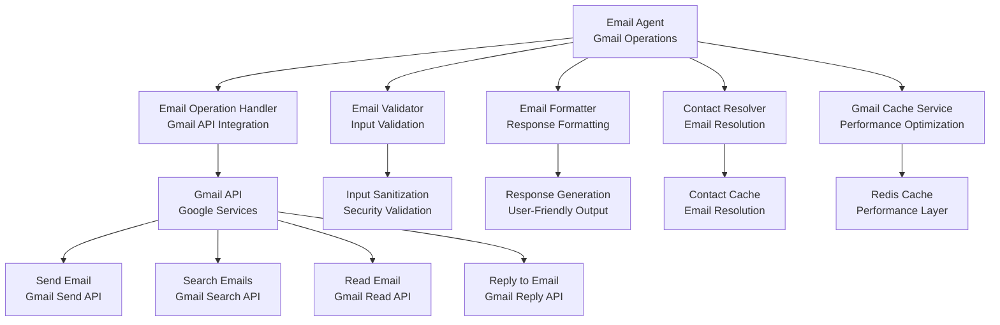
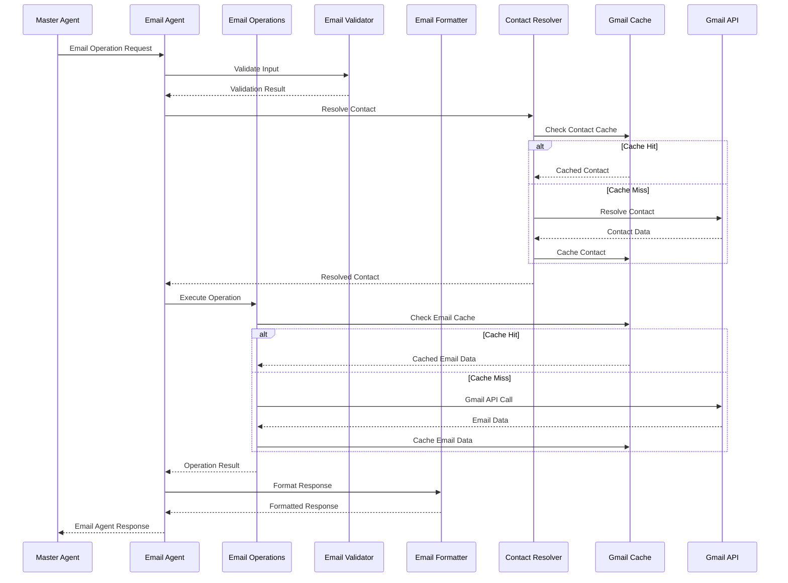

# Email Agent

The **Email Agent** handles Gmail operations and email management with AI-powered planning and intelligent caching. This document details the Email Agent's architecture, capabilities, and integration patterns.

## 📧 **Email Agent Architecture**

The Email Agent provides comprehensive email management capabilities through Gmail API integration with intelligent caching and AI-powered operation planning.

### **Email Agent Components**



### **Email Agent Processing Flow**



## 🎯 **Email Agent Capabilities**

### **Core Email Operations**

The Email Agent supports comprehensive email operations:

```typescript
export class EmailAgent extends AIAgent<EmailParams, EmailResult> {
  
  protected async processQuery(params: EmailParams): Promise<EmailResult> {
    // AI-powered email operation planning
    const plan = await this.generateExecutionPlan(params);
    
    // Execute email operations
    const results = await this.executePlan(plan);
    
    // Format and return results
    return this.formatEmailResults(results);
  }
  
  // Email operation methods
  async sendEmail(params: SendEmailParams): Promise<EmailResult> {
    const { to, subject, body, cc, bcc, attachments } = params;
    
    // Validate email parameters
    const validation = await this.validateEmailParams(params);
    if (!validation.isValid) {
      throw new Error(`Email validation failed: ${validation.errors.join(', ')}`);
    }
    
    // Resolve contacts if needed
    const resolvedContacts = await this.resolveContacts(params);
    
    // Send email via Gmail API
    const result = await this.emailOperationHandler.sendEmail({
      ...params,
      ...resolvedContacts
    });
    
    return {
      success: true,
      message: `Email sent successfully to ${to}`,
      data: result,
      metadata: {
        operation: 'send',
        recipientCount: 1 + (cc?.length || 0) + (bcc?.length || 0),
        hasAttachments: !!attachments?.length
      }
    };
  }
  
  async searchEmails(params: SearchEmailParams): Promise<EmailResult> {
    const { query, maxResults, accessToken } = params;
    
    // Use cached search if available
    const emails = await this.emailOperationHandler.searchEmails(query, maxResults, accessToken);
    
    return {
      success: true,
      message: `Found ${emails.length} emails matching "${query}"`,
      data: emails,
      metadata: {
        operation: 'search',
        query,
        resultCount: emails.length,
        maxResults
      }
    };
  }
  
  async readEmail(params: ReadEmailParams): Promise<EmailResult> {
    const { emailId, accessToken } = params;
    
    // Get email details
    const email = await this.emailOperationHandler.getEmail(emailId, accessToken);
    
    return {
      success: true,
      message: `Retrieved email: ${email.subject}`,
      data: email,
      metadata: {
        operation: 'read',
        emailId,
        hasAttachments: !!email.attachments?.length
      }
    };
  }
  
  async replyToEmail(params: ReplyEmailParams): Promise<EmailResult> {
    const { emailId, replyText, accessToken } = params;
    
    // Get original email
    const originalEmail = await this.emailOperationHandler.getEmail(emailId, accessToken);
    
    // Create reply
    const reply = await this.emailOperationHandler.replyToEmail({
      emailId,
      replyText,
      accessToken
    });
    
    return {
      success: true,
      message: `Replied to email: ${originalEmail.subject}`,
      data: reply,
      metadata: {
        operation: 'reply',
        originalEmailId: emailId,
        replyLength: replyText.length
      }
    };
  }
}
```

### **Tool Schema Definition**

The Email Agent exposes its capabilities through a standardized tool schema:

```typescript
const EmailToolSchema = {
  name: 'manage_emails',
  description: 'Handle email operations including send, search, read, reply, and forward',
  parameters: {
    type: 'object',
    properties: {
      query: { 
        type: 'string', 
        description: 'Email search query (for search operations)' 
      },
      operation: { 
        type: 'string', 
        enum: ['send', 'search', 'read', 'reply', 'forward'],
        description: 'Email operation type' 
      },
      contactEmail: { 
        type: 'string', 
        description: 'Recipient email address' 
      },
      recipientName: { 
        type: 'string', 
        description: 'Recipient name for personalization' 
      },
      subject: { 
        type: 'string', 
        description: 'Email subject line' 
      },
      body: { 
        type: 'string', 
        description: 'Email body content' 
      },
      threadId: { 
        type: 'string', 
        description: 'Email thread ID (for replies)' 
      },
      messageId: { 
        type: 'string', 
        description: 'Email message ID (for replies)' 
      },
      emailId: { 
        type: 'string', 
        description: 'Email ID (for read/reply operations)' 
      },
      maxResults: { 
        type: 'number', 
        description: 'Maximum number of results to return' 
      },
      cc: { 
        type: 'array', 
        items: { type: 'string' },
        description: 'CC recipients' 
      },
      bcc: { 
        type: 'array', 
        items: { type: 'string' },
        description: 'BCC recipients' 
      }
    },
    required: ['operation']
  }
};
```

## 🔧 **Email Agent Implementation**

### **Email Operation Handler**

The `EmailOperationHandler` manages direct Gmail API interactions:

```typescript
export class EmailOperationHandler extends BaseService {
  private gmailService: GmailService | null = null;
  private gmailCacheService: GmailCacheService | null = null;
  
  protected async onInitialize(): Promise<void> {
    const serviceManager = ServiceManager.getInstance();
    
    this.gmailService = serviceManager.getService<GmailService>('gmailService');
    this.gmailCacheService = serviceManager.getService<GmailCacheService>('gmailCacheService');
    
    if (!this.gmailService) {
      this.logWarn('GmailService not available - email operations will fail');
    }
    
    if (!this.gmailCacheService) {
      this.logWarn('GmailCacheService not available - using direct Gmail API calls');
    }
  }
  
  async searchEmails(query: string, maxResults: number, accessToken: string): Promise<any[]> {
    // Use cache service if available
    if (this.gmailCacheService) {
      return await this.gmailCacheService.searchEmails(query, maxResults, accessToken);
    }
    
    // Fallback to direct Gmail API
    if (!this.gmailService) {
      throw new Error('Gmail service not available');
    }
    
    return await this.gmailService.searchEmails(query, maxResults, accessToken);
  }
  
  async getEmail(emailId: string, accessToken: string): Promise<any> {
    // Use cache service if available
    if (this.gmailCacheService) {
      return await this.gmailCacheService.getEmail(emailId, accessToken);
    }
    
    // Fallback to direct Gmail API
    if (!this.gmailService) {
      throw new Error('Gmail service not available');
    }
    
    return await this.gmailService.getEmail(emailId, accessToken);
  }
  
  async sendEmail(params: SendEmailParams): Promise<any> {
    if (!this.gmailService) {
      throw new Error('Gmail service not available');
    }
    
    // Send email via Gmail API
    const result = await this.gmailService.sendEmail({
      to: params.to,
      subject: params.subject,
      body: params.body,
      cc: params.cc,
      bcc: params.bcc,
      attachments: params.attachments
    }, params.accessToken);
    
    return result;
  }
  
  async replyToEmail(params: ReplyEmailParams): Promise<any> {
    if (!this.gmailService) {
      throw new Error('Gmail service not available');
    }
    
    // Reply to email via Gmail API
    const result = await this.gmailService.replyToEmail({
      emailId: params.emailId,
      replyText: params.replyText,
      accessToken: params.accessToken
    });
    
    return result;
  }
}
```

### **Email Validator**

The `EmailValidator` ensures input validation and security:

```typescript
export class EmailValidator extends BaseService {
  
  async validateEmailParams(params: SendEmailParams): Promise<ValidationResult> {
    const errors: string[] = [];
    
    // Validate email addresses
    if (!params.to || !this.isValidEmail(params.to)) {
      errors.push('Invalid recipient email address');
    }
    
    if (params.cc) {
      for (const email of params.cc) {
        if (!this.isValidEmail(email)) {
          errors.push(`Invalid CC email address: ${email}`);
        }
      }
    }
    
    if (params.bcc) {
      for (const email of params.bcc) {
        if (!this.isValidEmail(email)) {
          errors.push(`Invalid BCC email address: ${email}`);
        }
      }
    }
    
    // Validate subject
    if (!params.subject || params.subject.trim().length === 0) {
      errors.push('Email subject is required');
    }
    
    if (params.subject && params.subject.length > 998) {
      errors.push('Email subject is too long (max 998 characters)');
    }
    
    // Validate body
    if (!params.body || params.body.trim().length === 0) {
      errors.push('Email body is required');
    }
    
    // Validate attachments
    if (params.attachments) {
      for (const attachment of params.attachments) {
        if (!attachment.name || !attachment.data) {
          errors.push('Invalid attachment format');
        }
        
        if (attachment.size && attachment.size > 25 * 1024 * 1024) { // 25MB limit
          errors.push(`Attachment ${attachment.name} is too large (max 25MB)`);
        }
      }
    }
    
    return {
      isValid: errors.length === 0,
      errors
    };
  }
  
  private isValidEmail(email: string): boolean {
    const emailRegex = /^[^\s@]+@[^\s@]+\.[^\s@]+$/;
    return emailRegex.test(email);
  }
  
  sanitizeEmailContent(content: string): string {
    // Remove potentially dangerous HTML/JavaScript
    return content
      .replace(/<script\b[^<]*(?:(?!<\/script>)<[^<]*)*<\/script>/gi, '')
      .replace(/javascript:/gi, '')
      .replace(/on\w+\s*=/gi, '');
  }
}
```

### **Email Formatter**

The `EmailFormatter` provides user-friendly response formatting:

```typescript
export class EmailFormatter extends BaseService {
  
  formatEmailSearchResult(emails: any[]): string {
    if (emails.length === 0) {
      return 'No emails found matching your search criteria.';
    }
    
    let formatted = `Found ${emails.length} email${emails.length === 1 ? '' : 's'}:\n\n`;
    
    emails.forEach((email, index) => {
      formatted += `${index + 1}. **${email.subject}**\n`;
      formatted += `   From: ${email.from}\n`;
      formatted += `   Date: ${new Date(email.date).toLocaleDateString()}\n`;
      formatted += `   Snippet: ${email.snippet}\n\n`;
    });
    
    return formatted;
  }
  
  formatEmailResponse(result: EmailResult): string {
    switch (result.metadata?.operation) {
      case 'send':
        return `✅ Email sent successfully to ${result.metadata.recipientCount} recipient${result.metadata.recipientCount === 1 ? '' : 's'}.`;
      
      case 'search':
        return this.formatEmailSearchResult(result.data);
      
      case 'read':
        return this.formatEmailDetails(result.data);
      
      case 'reply':
        return `✅ Reply sent successfully to "${result.metadata.originalEmailId}".`;
      
      default:
        return result.message || 'Email operation completed successfully.';
    }
  }
  
  private formatEmailDetails(email: any): string {
    let formatted = `**${email.subject}**\n\n`;
    formatted += `From: ${email.from}\n`;
    formatted += `To: ${email.to}\n`;
    formatted += `Date: ${new Date(email.date).toLocaleString()}\n\n`;
    formatted += `**Content:**\n${email.body}\n`;
    
    if (email.attachments && email.attachments.length > 0) {
      formatted += `\n**Attachments:**\n`;
      email.attachments.forEach((attachment: any) => {
        formatted += `- ${attachment.name} (${attachment.size} bytes)\n`;
      });
    }
    
    return formatted;
  }
  
  generateEmailProposal(params: SendEmailParams): ConfirmationProposal {
    return {
      type: 'email_send',
      title: 'Send Email Confirmation',
      message: `Are you sure you want to send this email?`,
      details: {
        to: params.to,
        subject: params.subject,
        body: params.body.substring(0, 200) + (params.body.length > 200 ? '...' : ''),
        cc: params.cc,
        bcc: params.bcc,
        hasAttachments: !!params.attachments?.length
      },
      actions: [
        { label: 'Send Email', action: 'confirm', style: 'primary' },
        { label: 'Cancel', action: 'cancel', style: 'secondary' }
      ]
    };
  }
}
```

### **Contact Resolver**

The `ContactResolver` handles email address resolution and validation:

```typescript
export class ContactResolver extends BaseService {
  private contactService: ContactService | null = null;
  private contactCacheService: ContactCacheService | null = null;
  
  protected async onInitialize(): Promise<void> {
    const serviceManager = ServiceManager.getInstance();
    
    this.contactService = serviceManager.getService<ContactService>('contactService');
    this.contactCacheService = serviceManager.getService<ContactCacheService>('contactCacheService');
    
    if (!this.contactService) {
      this.logWarn('ContactService not available - contact resolution will fail');
    }
  }
  
  async resolveByEmail(email: string, userId: string): Promise<ContactResolutionResult> {
    // Use cache service if available
    if (this.contactCacheService) {
      const cached = await this.contactCacheService.findContact(email, userId);
      if (cached) {
        return {
          success: true,
          contact: cached,
          source: 'cache'
        };
      }
    }
    
    // Fallback to direct contact service
    if (!this.contactService) {
      return {
        success: false,
        error: 'Contact service not available'
      };
    }
    
    const result = await this.contactService.searchContactsByEmail(email, userId);
    
    if (result.contacts.length > 0) {
      const contact = result.contacts[0];
      
      // Cache the result
      if (this.contactCacheService) {
        await this.contactCacheService.findContact(email, userId);
      }
      
      return {
        success: true,
        contact,
        source: 'api'
      };
    }
    
    return {
      success: false,
      error: 'Contact not found'
    };
  }
  
  async resolveByName(name: string, userId: string): Promise<ContactResolutionResult> {
    // Use cache service if available
    if (this.contactCacheService) {
      const cached = await this.contactCacheService.findContact(name, userId);
      if (cached) {
        return {
          success: true,
          contact: cached,
          source: 'cache'
        };
      }
    }
    
    // Fallback to direct contact service
    if (!this.contactService) {
      return {
        success: false,
        error: 'Contact service not available'
      };
    }
    
    const result = await this.contactService.searchContacts(name, userId);
    
    if (result.contacts.length > 0) {
      const contact = result.contacts[0];
      
      // Cache the result
      if (this.contactCacheService) {
        await this.contactCacheService.findContact(name, userId);
      }
      
      return {
        success: true,
        contact,
        source: 'api'
      };
    }
    
    return {
      success: false,
      error: 'Contact not found'
    };
  }
}
```

## 📊 **Email Agent Performance**

### **Performance Characteristics**

- **Search Operations**: <500ms with caching, <2s without caching
- **Send Operations**: <1s for simple emails, <3s for emails with attachments
- **Read Operations**: <200ms with caching, <1s without caching
- **Reply Operations**: <1s for simple replies, <2s for complex replies
- **Cache Hit Rate**: 70-90% for search operations, 80-95% for read operations

### **Caching Performance**

- **Gmail Search Cache**: 1 hour TTL, 70-90% hit rate
- **Email Details Cache**: 30 minutes TTL, 80-95% hit rate
- **Email Thread Cache**: 1 hour TTL, 60-80% hit rate
- **Contact Resolution Cache**: 2 hours TTL, 80-95% hit rate

## 🔧 **Email Agent Configuration**

### **Environment Configuration**

```bash
# Email Agent configuration
EMAIL_AGENT_ENABLED=true
EMAIL_AGENT_TIMEOUT=30000
EMAIL_AGENT_MAX_RESULTS=50
EMAIL_AGENT_CACHE_TTL=3600

# Gmail API configuration
GMAIL_API_ENABLED=true
GMAIL_API_TIMEOUT=15000
GMAIL_API_RETRY_ATTEMPTS=3

# Email validation
EMAIL_VALIDATION_ENABLED=true
EMAIL_MAX_SUBJECT_LENGTH=998
EMAIL_MAX_ATTACHMENT_SIZE=26214400
```

### **Email Agent Configuration**

```typescript
const emailAgentConfig = {
  enabled: process.env.EMAIL_AGENT_ENABLED === 'true',
  timeout: parseInt(process.env.EMAIL_AGENT_TIMEOUT || '30000'),
  maxResults: parseInt(process.env.EMAIL_AGENT_MAX_RESULTS || '50'),
  cacheTTL: parseInt(process.env.EMAIL_AGENT_CACHE_TTL || '3600'),
  
  gmail: {
    enabled: process.env.GMAIL_API_ENABLED === 'true',
    timeout: parseInt(process.env.GMAIL_API_TIMEOUT || '15000'),
    retryAttempts: parseInt(process.env.GMAIL_API_RETRY_ATTEMPTS || '3')
  },
  
  validation: {
    enabled: process.env.EMAIL_VALIDATION_ENABLED === 'true',
    maxSubjectLength: parseInt(process.env.EMAIL_MAX_SUBJECT_LENGTH || '998'),
    maxAttachmentSize: parseInt(process.env.EMAIL_MAX_ATTACHMENT_SIZE || '26214400')
  }
};
```

---

**Next**: [Calendar Agent](./agents/calendar-agent.md) - Google Calendar integration and scheduling
