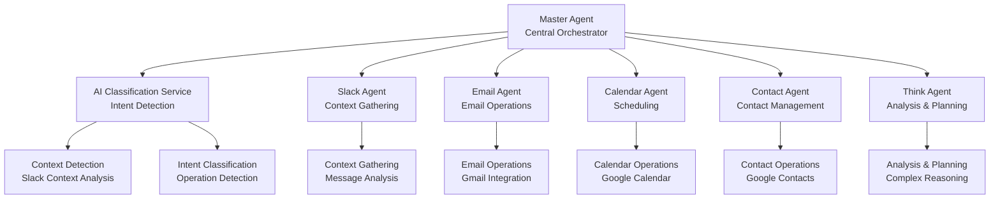
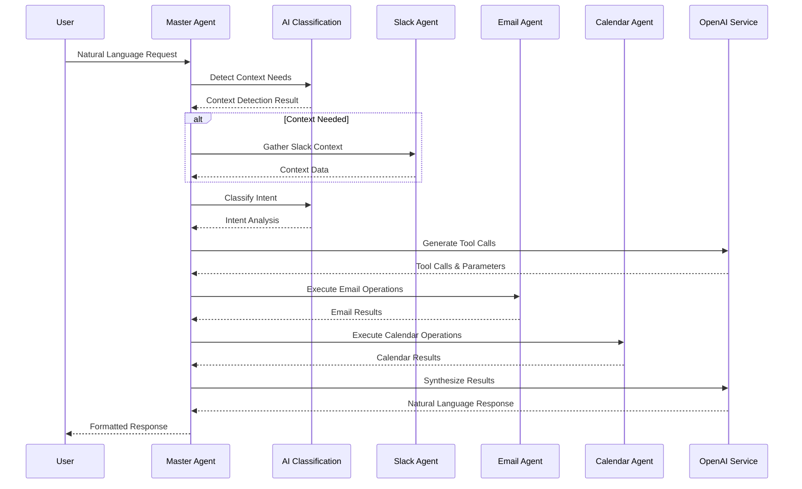

# Master Agent

The **Master Agent** is the central intelligence that orchestrates all other agents and handles complex multi-step operations. This document details the Master Agent's architecture, AI planning capabilities, and orchestration patterns.

## 🧠 **Master Agent Architecture**

The Master Agent serves as the **central orchestrator** in the multi-agent system, using AI-powered planning to understand user requests and coordinate specialized agents.

### **Master Agent Components**



### **Master Agent Processing Flow**



## 🎯 **Core Responsibilities**

### **1. Context Detection & Gathering**

The Master Agent determines if Slack context is needed and gathers relevant information:

```typescript
// Context detection and gathering
async processUserInput(
  userInput: string, 
  sessionId: string, 
  userId?: string,
  slackContext?: SlackContext
): Promise<MasterAgentResponse> {
  
  // Step 1: Detect if context is needed
  const aiClassificationService = this.getAIClassificationService();
  const contextDetection = await aiClassificationService.detectContextNeeds(userInput, slackContext);
  
  // Step 2: Gather context if needed
  let contextGathered: ContextGatheringResult | undefined;
  if (contextDetection.needsContext && slackContext) {
    const slackAgent = this.getSlackAgent();
    if (slackAgent) {
      contextGathered = await slackAgent.gatherContext(userInput, contextDetection, slackContext);
    }
  }
  
  // Continue with intent analysis...
}
```

### **2. Intent Analysis & Dependency Resolution**

The Master Agent analyzes user intent and resolves dependencies:

```typescript
// Intent analysis and dependency resolution
private async parseIntentAndResolveDependencies(
  userInput: string, 
  contextGathered?: ContextGatheringResult
): Promise<IntentAnalysisResult> {
  
  const contextPrompt = this.buildContextPrompt(userInput, contextGathered);
  
  const intentAnalysis = await this.openaiService.generateStructuredData(
    userInput,
    contextPrompt,
    this.getIntentAnalysisSchema(),
    { temperature: 0.1, maxTokens: 500 }
  );
  
  return {
    intent: intentAnalysis.intent,
    entities: intentAnalysis.entities,
    dependencies: intentAnalysis.dependencies,
    confidence: intentAnalysis.confidence,
    contextUsed: !!contextGathered
  };
}
```

### **3. AI Tool Generation**

The Master Agent generates appropriate tool calls using AI:

```typescript
// AI tool generation
private async generateToolCalls(
  userInput: string,
  intentAnalysis: IntentAnalysisResult,
  contextGathered?: ContextGatheringResult
): Promise<ToolCall[]> {
  
  const toolGenerationPrompt = this.buildToolGenerationPrompt(
    userInput, 
    intentAnalysis, 
    contextGathered
  );
  
  const toolCalls = await this.openaiService.generateToolCalls(
    userInput,
    toolGenerationPrompt,
    this.getAvailableTools(),
    { temperature: 0.1, maxTokens: 1000 }
  );
  
  return toolCalls;
}
```

### **4. Result Synthesis**

The Master Agent combines results from multiple agents into natural language:

```typescript
// Result synthesis
private async synthesizeResults(
  toolCalls: ToolCall[],
  executionResults: ToolResult[],
  userInput: string
): Promise<string> {
  
  const synthesisPrompt = this.buildSynthesisPrompt(
    userInput,
    toolCalls,
    executionResults
  );
  
  const response = await this.openaiService.generateResponse(
    synthesisPrompt,
    { temperature: 0.3, maxTokens: 1000 }
  );
  
  return response;
}
```

## 🔧 **Master Agent Implementation**

### **Core Master Agent Class**

```typescript
export class MasterAgent {
  private useOpenAI: boolean = false;
  private openaiService: OpenAIService | null = null;
  private aiClassificationService: AIClassificationService | null = null;
  private slackAgent: SlackAgent | null = null;
  private emailAgent: EmailAgent | null = null;
  private calendarAgent: CalendarAgent | null = null;
  private contactAgent: ContactAgent | null = null;
  private thinkAgent: ThinkAgent | null = null;
  
  constructor() {
    this.initializeServices();
  }
  
  private initializeServices(): void {
    const serviceManager = ServiceManager.getInstance();
    
    this.openaiService = serviceManager.getService<OpenAIService>('openaiService');
    this.aiClassificationService = serviceManager.getService<AIClassificationService>('aiClassificationService');
    this.slackAgent = serviceManager.getService<SlackAgent>('slackAgent');
    this.emailAgent = serviceManager.getService<EmailAgent>('emailAgent');
    this.calendarAgent = serviceManager.getService<CalendarAgent>('calendarAgent');
    this.contactAgent = serviceManager.getService<ContactAgent>('contactAgent');
    this.thinkAgent = serviceManager.getService<ThinkAgent>('thinkAgent');
    
    this.useOpenAI = !!this.openaiService && this.openaiService.isReady();
  }
  
  async processUserInput(
    userInput: string, 
    sessionId: string, 
    userId?: string,
    slackContext?: SlackContext
  ): Promise<MasterAgentResponse> {
    try {
      logger.info(`MasterAgent processing input: "${userInput}" for session: ${sessionId}`);
      
      // Check memory usage periodically
      this.checkMemoryUsage();
      
      // AI-first execution - no fallback routing
      if (!this.useOpenAI || !this.openaiService) {
        throw new Error('🤖 AI service is required but not available. Please check OpenAI configuration.');
      }

      // Step 1: Detect if context is needed
      const contextDetection = await this.aiClassificationService!.detectContextNeeds(userInput, slackContext);
      
      // Step 2: Gather context if needed
      let contextGathered: ContextGatheringResult | undefined;
      if (contextDetection.needsContext && slackContext) {
        contextGathered = await this.slackAgent!.gatherContext(userInput, contextDetection, slackContext);
      }

      // Step 3: Parse intent and resolve dependencies
      const intentAnalysis = await this.parseIntentAndResolveDependencies(userInput, contextGathered);

      // Step 4: Generate tool calls using AI
      const toolCalls = await this.generateToolCalls(userInput, intentAnalysis, contextGathered);

      // Step 5: Generate proposal if confirmation needed
      const proposal = await this.generateProposal(toolCalls);

      // Step 6: Generate response message
      const message = this.generateResponseMessage(toolCalls, proposal);

      return {
        message,
        toolCalls,
        proposal,
        metadata: {
          sessionId,
          userId,
          contextType: contextDetection.contextType,
          confidence: contextDetection.confidence,
          intent: intentAnalysis.intent,
          entities: intentAnalysis.entities
        }
      };
      
    } catch (error) {
      logger.error('MasterAgent processing failed', { error, userInput, sessionId });
      throw error;
    }
  }
}
```

### **AI Planning System**

The Master Agent uses sophisticated AI planning to understand and execute complex requests:

```typescript
// AI planning implementation
private async generateExecutionPlan(
  userInput: string,
  intentAnalysis: IntentAnalysisResult,
  contextGathered?: ContextGatheringResult
): Promise<ExecutionPlan> {
  
  const planningPrompt = this.buildPlanningPrompt(userInput, intentAnalysis, contextGathered);
  
  const plan = await this.openaiService!.generateStructuredData(
    userInput,
    planningPrompt,
    this.getPlanningSchema(),
    { temperature: 0.1, maxTokens: 1000 }
  );
  
  return {
    id: `plan-${Date.now()}`,
    steps: plan.steps,
    dependencies: plan.dependencies,
    estimatedTime: plan.estimatedTime,
    confidence: plan.confidence
  };
}
```

### **Tool Call Generation**

The Master Agent generates appropriate tool calls based on user intent:

```typescript
// Tool call generation
private async generateToolCalls(
  userInput: string,
  intentAnalysis: IntentAnalysisResult,
  contextGathered?: ContextGatheringResult
): Promise<ToolCall[]> {
  
  const toolGenerationPrompt = this.buildToolGenerationPrompt(
    userInput, 
    intentAnalysis, 
    contextGathered
  );
  
  const toolCalls = await this.openaiService!.generateToolCalls(
    userInput,
    toolGenerationPrompt,
    this.getAvailableTools(),
    { temperature: 0.1, maxTokens: 1000 }
  );
  
  // Validate tool calls
  return this.validateToolCalls(toolCalls);
}
```

## 🎯 **Agent Orchestration**

### **Smart Routing Logic**

The Master Agent implements intelligent routing based on user input:

```typescript
// Smart routing implementation
private generateSystemPrompt(): string {
  return `
You are the Master Agent, the central orchestrator of an AI assistant platform.

## Available Tools
- **manage_emails**: Handle email operations (send, search, read, reply)
- **manage_calendar**: Handle calendar operations (create, update, delete events)
- **search_contacts**: Search and manage contacts
- **read_slack_messages**: Read Slack messages for context

## Agent Orchestration Rules
- **SMART EMAIL ROUTING**: When user provides email addresses (with @ symbol), call manage_emails DIRECTLY - NO contact resolution needed
- **SMART PERSON ROUTING**: When user provides person names (no @ symbol), call search_contacts first, then manage_emails
- **CONFIRMATION REQUIRED**: All email and calendar operations require user confirmation before execution
- **CRITICAL: Use Slack agent proactively** when user requests are ambiguous or lack context - read recent messages first
- When user asks follow-up questions (like "what about X?" or "other Y?"), ALWAYS check Slack context before proceeding

## Context Usage
- Use Slack context when user references "that email", "the meeting", "what we discussed"
- Use Slack context for follow-up questions and clarifications
- Use Slack context when user input is ambiguous or incomplete

## Response Format
Always provide clear, actionable responses with appropriate tool calls.
`;
}
```

### **Agent Coordination**

The Master Agent coordinates multiple agents for complex operations:

```typescript
// Agent coordination
private async coordinateAgents(
  toolCalls: ToolCall[],
  context: ToolExecutionContext
): Promise<ToolResult[]> {
  
  const results: ToolResult[] = [];
  
  for (const toolCall of toolCalls) {
    try {
      let result: ToolResult;
      
      switch (toolCall.name) {
        case 'manage_emails':
          result = await this.emailAgent!.execute(toolCall.parameters, context);
          break;
        case 'manage_calendar':
          result = await this.calendarAgent!.execute(toolCall.parameters, context);
          break;
        case 'search_contacts':
          result = await this.contactAgent!.execute(toolCall.parameters, context);
          break;
        case 'read_slack_messages':
          result = await this.slackAgent!.execute(toolCall.parameters, context);
          break;
        default:
          throw new Error(`Unknown tool: ${toolCall.name}`);
      }
      
      results.push(result);
      
    } catch (error) {
      results.push({
        toolName: toolCall.name,
        result: null,
        success: false,
        error: error instanceof Error ? error.message : 'Unknown error',
        executionTime: 0
      });
    }
  }
  
  return results;
}
```

## 📊 **Master Agent Performance**

### **Performance Characteristics**

- **Response Time**: <2 seconds for complex multi-step operations
- **Context Understanding**: 90%+ accuracy for Slack context extraction
- **Intent Classification**: 95%+ accuracy for operation detection
- **Tool Generation**: 90%+ accuracy for appropriate tool selection
- **Memory Usage**: Optimized with periodic cleanup

### **AI Model Usage**

- **Primary Model**: OpenAI GPT-4o-mini
- **Temperature**: 0.1 for deterministic operations, 0.3 for creative synthesis
- **Max Tokens**: 1000 for planning, 2000 for synthesis
- **Rate Limiting**: Built-in circuit breaker and retry logic

### **Memory Management**

```typescript
// Memory management
private checkMemoryUsage(): void {
  const memUsage = process.memoryUsage();
  const memUsageMB = {
    rss: Math.round(memUsage.rss / 1024 / 1024),
    heapTotal: Math.round(memUsage.heapTotal / 1024 / 1024),
    heapUsed: Math.round(memUsage.heapUsed / 1024 / 1024),
    external: Math.round(memUsage.external / 1024 / 1024)
  };
  
  if (memUsageMB.heapUsed > 500) { // 500MB threshold
    logger.warn('High memory usage detected', memUsageMB);
    
    // Force garbage collection if available
    if (global.gc) {
      global.gc();
      logger.info('Garbage collection triggered');
    }
  }
}
```

## 🔧 **Master Agent Configuration**

### **Environment Configuration**

```bash
# Master Agent configuration
MASTER_AGENT_ENABLED=true
MASTER_AGENT_TIMEOUT=30000
MASTER_AGENT_MAX_STEPS=10
MASTER_AGENT_RETRY_ATTEMPTS=3
MASTER_AGENT_MEMORY_THRESHOLD=500

# AI configuration
OPENAI_API_KEY=sk-...
OPENAI_MODEL=gpt-4o-mini
OPENAI_TEMPERATURE=0.1
OPENAI_MAX_TOKENS=1000
```

### **Master Agent Configuration**

```typescript
const masterAgentConfig = {
  enabled: process.env.MASTER_AGENT_ENABLED === 'true',
  timeout: parseInt(process.env.MASTER_AGENT_TIMEOUT || '30000'),
  maxSteps: parseInt(process.env.MASTER_AGENT_MAX_STEPS || '10'),
  retryAttempts: parseInt(process.env.MASTER_AGENT_RETRY_ATTEMPTS || '3'),
  memoryThreshold: parseInt(process.env.MASTER_AGENT_MEMORY_THRESHOLD || '500'),
  
  ai: {
    model: process.env.OPENAI_MODEL || 'gpt-4o-mini',
    temperature: parseFloat(process.env.OPENAI_TEMPERATURE || '0.1'),
    maxTokens: parseInt(process.env.OPENAI_MAX_TOKENS || '1000')
  }
};
```

## 🚀 **Master Agent Deployment**

The Master Agent is deployed as part of the main application:

- **Stateless Design**: No persistent state between requests
- **Horizontal Scaling**: Multiple instances can handle requests
- **Health Monitoring**: Reports health status to ServiceManager
- **Graceful Shutdown**: Proper cleanup on termination

---

**Next**: [Email Agent](./agents/email-agent.md) - Gmail operations and email management
