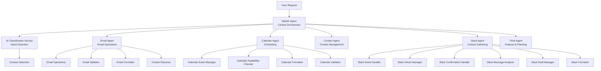
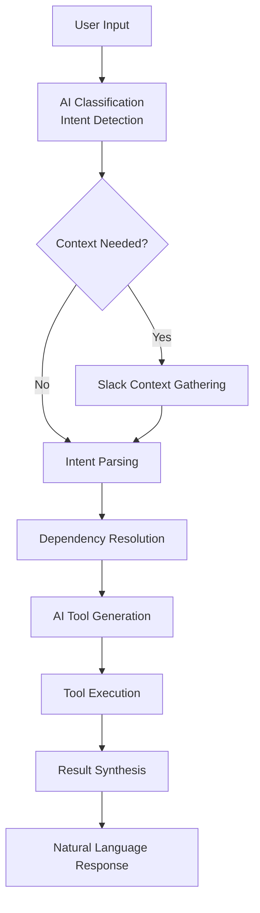
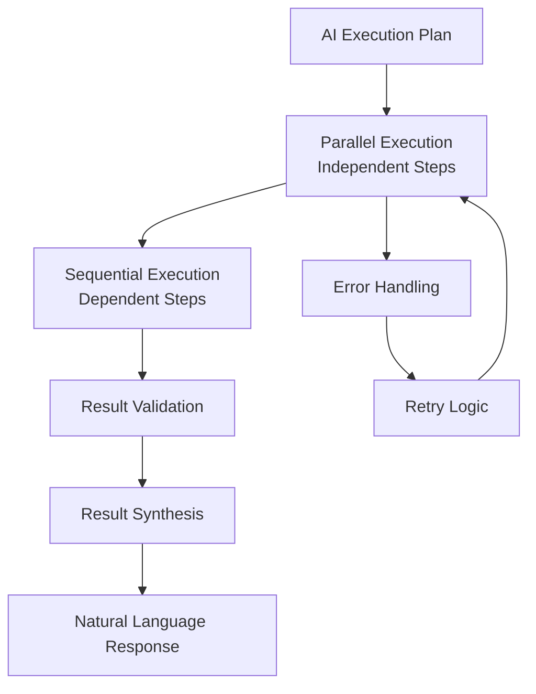

# AI Agent System

The AI Assistant Platform implements a sophisticated **multi-agent system** with **AI-first design principles**. This document details the agent architecture, AI planning, and orchestration patterns.

## 🧠 **Multi-Agent Architecture**

The platform uses **specialized AI agents** that work together under the orchestration of a **Master Agent** to handle complex user requests intelligently.

### **Agent Hierarchy**



## 🎯 **Master Agent - Central Orchestrator**

The **Master Agent** is the central intelligence that coordinates all other agents and handles complex multi-step operations.

### **Core Responsibilities**

- **Intent Classification**: Understanding user requests using AI
- **Context Detection**: Determining if Slack context is needed
- **Tool Generation**: Creating appropriate tool calls using AI
- **Workflow Orchestration**: Coordinating multi-agent operations
- **Result Synthesis**: Combining results into natural language responses

### **AI Planning Flow**



### **Master Agent Implementation**

```typescript
export class MasterAgent {
  async processUserInput(
    userInput: string, 
    sessionId: string, 
    userId?: string,
    slackContext?: SlackContext
  ): Promise<MasterAgentResponse> {
    
    // Step 1: Context Detection
    const contextDetection = await this.aiClassificationService
      .detectContextNeeds(userInput, slackContext);
    
    // Step 2: Context Gathering (if needed)
    let contextGathered: ContextGatheringResult | undefined;
    if (contextDetection.needsContext && slackContext) {
      contextGathered = await this.slackAgent
        .gatherContext(userInput, contextDetection, slackContext);
    }
    
    // Step 3: Intent Analysis & Dependency Resolution
    const intentAnalysis = await this.parseIntentAndResolveDependencies(
      userInput, contextGathered
    );
    
    // Step 4: AI Tool Generation
    const toolCalls = await this.generateToolCalls(
      userInput, intentAnalysis, contextGathered
    );
    
    // Step 5: Proposal Generation (if confirmation needed)
    const proposal = await this.generateProposal(toolCalls);
    
    return {
      message: this.generateResponseMessage(toolCalls, proposal),
      toolCalls,
      proposal,
      metadata: {
        sessionId,
        userId,
        contextType: contextDetection.contextType,
        confidence: contextDetection.confidence
      }
    };
  }
}
```

## 🤖 **Specialized Agents**

### **Email Agent**

**Purpose**: Gmail operations and email management

**Capabilities**:
- Send emails with natural language
- Search and filter emails
- Reply to emails
- Draft management
- Attachment handling

**AI Planning**:
```typescript
export class EmailAgent extends AIAgent<EmailParams, EmailResult> {
  protected async processQuery(params: EmailParams): Promise<EmailResult> {
    // AI-powered email operation planning
    const plan = await this.generateExecutionPlan(params);
    
    // Execute email operations
    const results = await this.executePlan(plan);
    
    // Format and return results
    return this.formatEmailResults(results);
  }
}
```

**Tool Schema**:
```typescript
const EmailToolSchema = {
  name: 'manage_emails',
  description: 'Handle email operations including send, search, read, reply',
  parameters: {
    type: 'object',
    properties: {
      query: { type: 'string', description: 'Email search query' },
      operation: { 
        type: 'string', 
        enum: ['send', 'search', 'read', 'reply', 'forward'],
        description: 'Email operation type'
      },
      contactEmail: { type: 'string', description: 'Recipient email' },
      subject: { type: 'string', description: 'Email subject' },
      body: { type: 'string', description: 'Email body' },
      maxResults: { type: 'number', description: 'Maximum results to return' }
    },
    required: ['operation']
  }
};
```

### **Calendar Agent**

**Purpose**: Calendar events and scheduling

**Capabilities**:
- Create calendar events
- Update existing events
- Check availability
- Schedule meetings
- Handle recurring events

**AI Planning**:
```typescript
export class CalendarAgent extends AIAgent<CalendarParams, CalendarResult> {
  protected async processQuery(params: CalendarParams): Promise<CalendarResult> {
    // AI-powered calendar operation planning
    const plan = await this.generateExecutionPlan(params);
    
    // Execute calendar operations
    const results = await this.executePlan(plan);
    
    // Format and return results
    return this.formatCalendarResults(results);
  }
}
```

**Tool Schema**:
```typescript
const CalendarToolSchema = {
  name: 'manage_calendar',
  description: 'Handle calendar operations including create, update, delete events',
  parameters: {
    type: 'object',
    properties: {
      operation: { 
        type: 'string', 
        enum: ['create', 'update', 'delete', 'list', 'check_availability'],
        description: 'Calendar operation type'
      },
      title: { type: 'string', description: 'Event title' },
      startTime: { type: 'string', description: 'Event start time' },
      endTime: { type: 'string', description: 'Event end time' },
      attendees: { type: 'array', description: 'Event attendees' },
      description: { type: 'string', description: 'Event description' }
    },
    required: ['operation']
  }
};
```

### **Contact Agent**

**Purpose**: Contact management and resolution

**Capabilities**:
- Search contacts
- Resolve email addresses
- Validate contact information
- Manage contact groups

**AI Planning**:
```typescript
export class ContactAgent extends AIAgent<ContactParams, ContactResult> {
  protected async processQuery(params: ContactParams): Promise<ContactResult> {
    // AI-powered contact operation planning
    const plan = await this.generateExecutionPlan(params);
    
    // Execute contact operations
    const results = await this.executePlan(plan);
    
    // Format and return results
    return this.formatContactResults(results);
  }
}
```

**Tool Schema**:
```typescript
const ContactToolSchema = {
  name: 'search_contacts',
  description: 'Search and manage contacts',
  parameters: {
    type: 'object',
    properties: {
      query: { type: 'string', description: 'Contact search query' },
      email: { type: 'string', description: 'Email address to search' },
      name: { type: 'string', description: 'Name to search' },
      maxResults: { type: 'number', description: 'Maximum results to return' }
    },
    required: ['query']
  }
};
```

### **Slack Agent**

**Purpose**: Slack integration and context gathering

**Capabilities**:
- Read Slack messages
- Extract context from conversations
- Handle Slack events
- Manage Slack OAuth

**AI Planning**:
```typescript
export class SlackAgent extends AIAgent<SlackParams, SlackResult> {
  protected async processQuery(params: SlackParams): Promise<SlackResult> {
    // AI-powered Slack operation planning
    const plan = await this.generateExecutionPlan(params);
    
    // Execute Slack operations
    const results = await this.executePlan(plan);
    
    // Format and return results
    return this.formatSlackResults(results);
  }
}
```

**Tool Schema**:
```typescript
const SlackToolSchema = {
  name: 'read_slack_messages',
  description: 'Read and analyze Slack messages for context',
  parameters: {
    type: 'object',
    properties: {
      channelId: { type: 'string', description: 'Slack channel ID' },
      limit: { type: 'number', description: 'Number of messages to read' },
      contextType: { 
        type: 'string', 
        enum: ['recent_messages', 'thread_history', 'search_results'],
        description: 'Type of context to gather'
      }
    },
    required: ['channelId']
  }
};
```

### **Think Agent**

**Purpose**: Analysis, planning, and complex reasoning

**Capabilities**:
- Complex problem analysis
- Multi-step planning
- Data analysis and insights
- Strategic thinking

**AI Planning**:
```typescript
export class ThinkAgent extends AIAgent<ThinkParams, ThinkResult> {
  protected async processQuery(params: ThinkParams): Promise<ThinkResult> {
    // AI-powered thinking and analysis
    const plan = await this.generateExecutionPlan(params);
    
    // Execute thinking operations
    const results = await this.executePlan(plan);
    
    // Format and return results
    return this.formatThinkResults(results);
  }
}
```

## 🔄 **AI Planning & Execution**

### **AI Planning Process**

The AI planning system uses **OpenAI GPT-4o-mini** to understand user requests and generate execution plans:

```typescript
interface AIPlanningResult {
  success: boolean;
  plan?: ExecutionPlan;
  error?: string;
  executionTime?: number;
}

interface ExecutionPlan {
  id: string;
  steps: ExecutionStep[];
  dependencies: string[];
  estimatedTime: number;
}

interface ExecutionStep {
  id: string;
  agent: string;
  operation: string;
  parameters: Record<string, any>;
  dependencies: string[];
  estimatedTime: number;
}
```

### **Execution Flow**



### **AI Planning Implementation**

```typescript
protected async generateExecutionPlan(params: TParams): Promise<AIPlanningResult> {
  const planningPrompt = this.buildPlanningPrompt(params);
  
  const response = await this.openaiService.generateStructuredData(
    params.userInput || JSON.stringify(params),
    planningPrompt,
    this.getPlanningSchema(),
    { temperature: 0.1, maxTokens: 1000 }
  );
  
  return this.validateAndFormatPlan(response);
}
```

## 🎯 **Agent Factory & Tool Management**

The **AgentFactory** manages agent registration and tool discovery:

```typescript
export class AgentFactory {
  private static agents = new Map<string, AIAgent>();
  private static toolMetadata = new Map<string, ToolMetadata>();
  
  static registerAgent(name: string, agent: AIAgent): void {
    this.agents.set(name, agent);
    this.autoRegisterTools(name, agent);
  }
  
  static async executeAgent(
    name: string, 
    parameters: Record<string, any>,
    context: ToolExecutionContext
  ): Promise<ToolResult> {
    const agent = this.getAgentByToolName(name);
    return await agent.execute(parameters, context);
  }
  
  static generateOpenAIFunctions(): OpenAIFunctionSchema[] {
    return Array.from(this.toolMetadata.values())
      .map(tool => this.convertToOpenAISchema(tool));
  }
}
```

## 📊 **Agent Performance Metrics**

### **Performance Characteristics**

- **Response Time**: <500ms for simple operations, <2s for complex multi-step operations
- **Accuracy**: 95%+ for intent classification and tool selection
- **Context Understanding**: 90%+ accuracy for Slack context extraction
- **Error Recovery**: Automatic retry with exponential backoff

### **AI Model Usage**

- **Primary Model**: OpenAI GPT-4o-mini
- **Temperature**: 0.1 for deterministic operations, 0.3 for creative tasks
- **Max Tokens**: 1000 for planning, 2000 for synthesis
- **Rate Limiting**: Built-in circuit breaker and retry logic

## 🔧 **Agent Configuration**

### **Environment Variables**

```bash
# AI Configuration
OPENAI_API_KEY=sk-...
OPENAI_MODEL=gpt-4o-mini
OPENAI_TEMPERATURE=0.1
OPENAI_MAX_TOKENS=1000

# Agent Configuration
ENABLE_AI_PLANNING=true
AI_PLANNING_TIMEOUT=30000
AI_PLANNING_MAX_STEPS=10
AI_PLANNING_RETRY_ATTEMPTS=3
```

### **Agent-Specific Configuration**

```typescript
const agentConfig = {
  master: {
    enableAIPlanning: true,
    maxPlanningSteps: 10,
    timeout: 30000
  },
  email: {
    enableAIPlanning: true,
    maxPlanningSteps: 5,
    timeout: 15000
  },
  calendar: {
    enableAIPlanning: true,
    maxPlanningSteps: 7,
    timeout: 20000
  }
};
```

## 🚀 **Agent Deployment**

Agents are deployed as part of the main application:

- **Stateless Design**: Agents don't maintain state between requests
- **Horizontal Scaling**: Multiple instances can handle requests
- **Health Monitoring**: Each agent reports health status
- **Graceful Shutdown**: Proper cleanup on termination

---

**Next**: [Data Flow](./data-flow.md) - Request processing and data flow patterns
