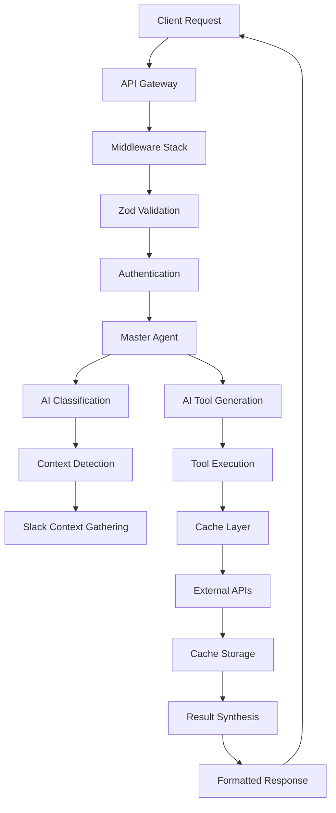
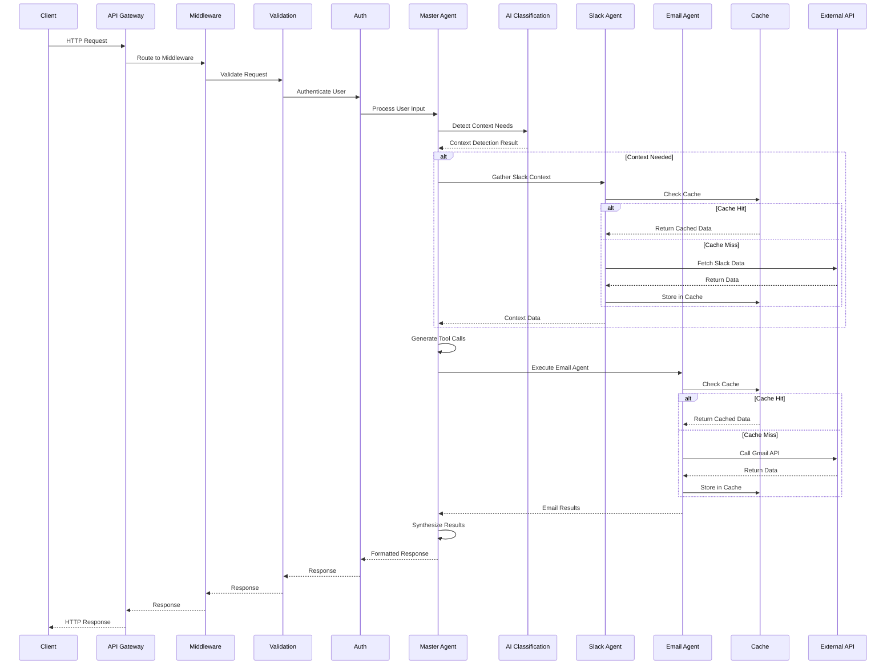
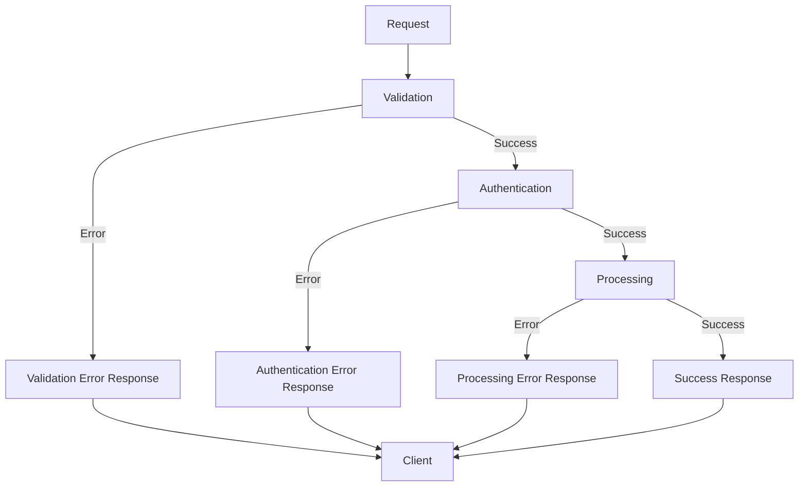
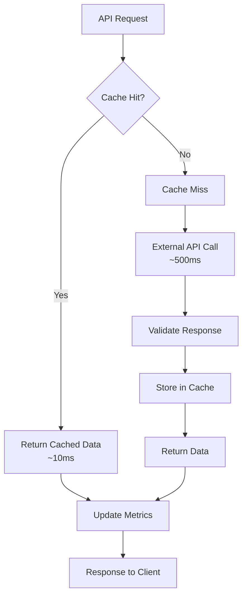
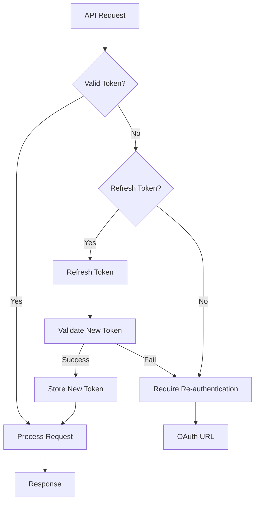

# Data Flow

The AI Assistant Platform implements sophisticated **data flow patterns** that ensure efficient request processing, intelligent caching, and seamless integration between services. This document details the data flow architecture and processing patterns.

## 🔄 **Request Processing Flow**

### **High-Level Data Flow**



### **Detailed Processing Pipeline**



## 🎯 **Data Flow Patterns**

### **1. Request Processing Pattern**

**Input Validation & Sanitization**
```typescript
// Request processing pipeline
const processRequest = async (req: Request) => {
  // 1. Input sanitization
  const sanitizedInput = sanitizeInput(req.body);
  
  // 2. Zod validation
  const validatedData = requestSchema.parse(sanitizedInput);
  
  // 3. Authentication
  const user = await authenticateRequest(req);
  
  // 4. Rate limiting
  await checkRateLimit(user.id);
  
  // 5. Process with Master Agent
  const result = await masterAgent.processUserInput(
    validatedData.command,
    validatedData.sessionId,
    user.id
  );
  
  return result;
};
```

**Error Handling Flow**


### **2. AI Planning Data Flow**

**Intent Classification & Planning**
```typescript
// AI planning data flow
const aiPlanningFlow = async (userInput: string, context?: SlackContext) => {
  // 1. Context detection
  const contextDetection = await aiClassificationService.detectContextNeeds(
    userInput, context
  );
  
  // 2. Context gathering (if needed)
  let gatheredContext: ContextGatheringResult | undefined;
  if (contextDetection.needsContext) {
    gatheredContext = await slackAgent.gatherContext(
      userInput, contextDetection, context
    );
  }
  
  // 3. Intent analysis
  const intentAnalysis = await aiClassificationService.classifyIntent(
    userInput, gatheredContext
  );
  
  // 4. Tool generation
  const toolCalls = await openaiService.generateToolCalls(
    userInput, intentAnalysis, gatheredContext
  );
  
  // 5. Execution planning
  const executionPlan = await toolRoutingService.planExecution(toolCalls);
  
  return { toolCalls, executionPlan, gatheredContext };
};
```

### **3. Caching Data Flow**

**Cache-First Pattern**


**Cache Implementation Pattern**
```typescript
// Cache-first data flow
const cacheFirstFlow = async <T>(
  cacheKey: string,
  fetchFunction: () => Promise<T>,
  ttl: number
): Promise<T> => {
  // 1. Check cache first
  const cached = await cacheService.get<T>(cacheKey);
  if (cached) {
    cacheMetrics.recordHit();
    return cached;
  }
  
  // 2. Cache miss - fetch from source
  cacheMetrics.recordMiss();
  const data = await fetchFunction();
  
  // 3. Store in cache
  await cacheService.set(cacheKey, data, ttl);
  
  // 4. Return data
  return data;
};
```

### **4. OAuth Token Flow**

**Token Management Data Flow**


**Token Flow Implementation**
```typescript
// OAuth token data flow
const tokenFlow = async (teamId: string, userId: string) => {
  // 1. Get stored tokens
  const tokens = await tokenStorageService.getUserTokens(`${teamId}:${userId}`);
  
  // 2. Validate token
  const validation = tokenManager.validateToken(tokens.googleTokens);
  
  if (validation.isValid) {
    return tokens.googleTokens.access_token;
  }
  
  // 3. Token invalid - try refresh
  if (tokens.googleTokens.refresh_token) {
    const refreshedTokens = await authService.refreshGoogleToken(
      tokens.googleTokens.refresh_token
    );
    
    // 4. Store refreshed tokens
    await tokenStorageService.storeUserTokens(
      `${teamId}:${userId}`,
      { google: refreshedTokens }
    );
    
    return refreshedTokens.access_token;
  }
  
  // 5. No refresh token - require re-auth
  throw new AuthenticationError('Token expired and no refresh token available');
};
```

## 🔄 **Service Communication Patterns**

### **1. Synchronous Communication**

**Direct Service Calls**
```typescript
// Synchronous service communication
const synchronousFlow = async () => {
  const configService = serviceManager.getService<ConfigService>('configService');
  const databaseService = serviceManager.getService<DatabaseService>('databaseService');
  
  // Direct service calls
  const config = configService.getConfig();
  const result = await databaseService.query('SELECT * FROM users');
  
  return { config, result };
};
```

### **2. Asynchronous Communication**

**Event-Driven Communication**
```typescript
// Asynchronous service communication
const asynchronousFlow = async () => {
  // Emit event
  eventEmitter.emit('user.action', {
    userId: '123',
    action: 'email.sent',
    timestamp: new Date()
  });
  
  // Listen for events
  eventEmitter.on('user.action', async (data) => {
    await auditLogger.logAction(data);
    await metricsService.recordAction(data);
  });
};
```

### **3. Cache Communication**

**Cache Service Integration**
```typescript
// Cache service communication pattern
const cacheCommunicationFlow = async () => {
  const cacheService = serviceManager.getService<CacheService>('cacheService');
  const gmailService = serviceManager.getService<GmailService>('gmailService');
  
  // Cache-first pattern
  const cacheKey = `gmail:search:${query}`;
  const cached = await cacheService.get(cacheKey);
  
  if (cached) {
    return cached;
  }
  
  // Fetch from service
  const data = await gmailService.searchEmails(query);
  
  // Store in cache
  await cacheService.set(cacheKey, data, 3600); // 1 hour TTL
  
  return data;
};
```

## 📊 **Data Transformation Patterns**

### **1. Input Transformation**

**Request Data Processing**
```typescript
// Input transformation pipeline
const transformInput = (rawInput: any) => {
  // 1. Sanitization
  const sanitized = sanitizeInput(rawInput);
  
  // 2. Validation
  const validated = inputSchema.parse(sanitized);
  
  // 3. Normalization
  const normalized = normalizeInput(validated);
  
  // 4. Enrichment
  const enriched = enrichInput(normalized);
  
  return enriched;
};
```

### **2. Output Transformation**

**Response Data Processing**
```typescript
// Output transformation pipeline
const transformOutput = (rawOutput: any) => {
  // 1. Formatting
  const formatted = formatOutput(rawOutput);
  
  // 2. Validation
  const validated = outputSchema.parse(formatted);
  
  // 3. Sanitization
  const sanitized = sanitizeOutput(validated);
  
  // 4. Metadata addition
  const withMetadata = addMetadata(sanitized);
  
  return withMetadata;
};
```

### **3. Data Aggregation**

**Multi-Source Data Aggregation**
```typescript
// Data aggregation pattern
const aggregateData = async (sources: DataSource[]) => {
  // 1. Parallel data fetching
  const promises = sources.map(source => fetchData(source));
  const results = await Promise.allSettled(promises);
  
  // 2. Filter successful results
  const successful = results
    .filter(result => result.status === 'fulfilled')
    .map(result => result.value);
  
  // 3. Merge data
  const merged = mergeData(successful);
  
  // 4. Deduplicate
  const deduplicated = deduplicateData(merged);
  
  return deduplicated;
};
```

## 🔧 **Data Flow Configuration**

### **Environment Configuration**

```bash
# Data flow configuration
REQUEST_TIMEOUT=30000
CACHE_TTL_DEFAULT=300
CACHE_TTL_GMAIL=3600
CACHE_TTL_CONTACTS=7200
CACHE_TTL_SLACK=1800

# Rate limiting
RATE_LIMIT_WINDOW=60000
RATE_LIMIT_MAX_REQUESTS=100

# AI configuration
AI_PLANNING_TIMEOUT=30000
AI_PLANNING_MAX_STEPS=10
AI_CONTEXT_LIMIT=50
```

### **Service Configuration**

```typescript
// Data flow service configuration
const dataFlowConfig = {
  request: {
    timeout: parseInt(process.env.REQUEST_TIMEOUT || '30000'),
    maxSize: parseInt(process.env.REQUEST_MAX_SIZE || '1048576'), // 1MB
    rateLimit: {
      window: parseInt(process.env.RATE_LIMIT_WINDOW || '60000'),
      maxRequests: parseInt(process.env.RATE_LIMIT_MAX_REQUESTS || '100')
    }
  },
  cache: {
    defaultTTL: parseInt(process.env.CACHE_TTL_DEFAULT || '300'),
    gmailTTL: parseInt(process.env.CACHE_TTL_GMAIL || '3600'),
    contactsTTL: parseInt(process.env.CACHE_TTL_CONTACTS || '7200'),
    slackTTL: parseInt(process.env.CACHE_TTL_SLACK || '1800')
  },
  ai: {
    planningTimeout: parseInt(process.env.AI_PLANNING_TIMEOUT || '30000'),
    maxSteps: parseInt(process.env.AI_PLANNING_MAX_STEPS || '10'),
    contextLimit: parseInt(process.env.AI_CONTEXT_LIMIT || '50')
  }
};
```

## 📈 **Data Flow Performance**

### **Performance Metrics**

- **Request Processing**: <100ms average
- **Cache Hit Rate**: 70-90% for external APIs
- **AI Planning**: <2s for complex operations
- **Token Refresh**: <500ms average
- **Data Transformation**: <10ms per operation

### **Optimization Strategies**

- **Parallel Processing**: Independent operations run concurrently
- **Intelligent Caching**: Domain-specific TTL strategies
- **Connection Pooling**: Efficient database and cache connections
- **Lazy Loading**: Services initialized only when needed
- **Memory Management**: Proper cleanup and garbage collection

---

**Next**: [Service Manager](./services/service-manager.md) - Dependency injection and lifecycle management
