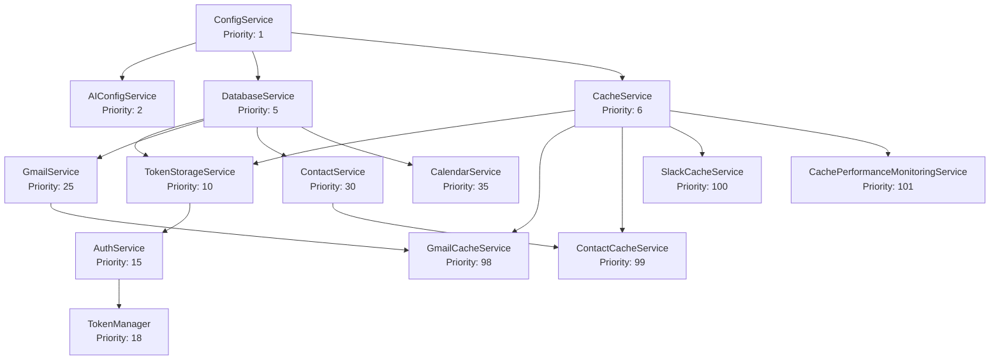
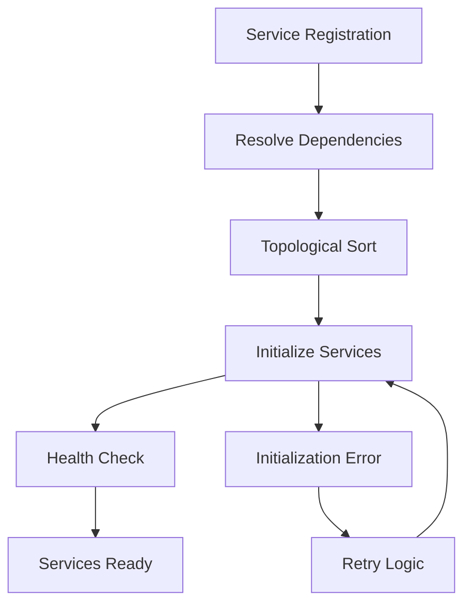

# Service Architecture

The AI Assistant Platform implements a sophisticated **service-oriented architecture** with **dependency injection** and **lifecycle management**. This document details the service design, dependencies, and orchestration patterns.

## 🏗️ **Service Manager Architecture**

The **ServiceManager** is the central dependency injection container that orchestrates 26+ services with automatic dependency resolution and lifecycle management.

### **Service Registration Pattern**

```typescript
// Service registration with dependencies
serviceManager.registerService('emailService', new EmailService(), {
  dependencies: ['databaseService', 'cacheService'],
  priority: 20,
  autoStart: true
});
```

### **Dependency Resolution**

Services are automatically initialized in **topological order** based on dependencies:



## 🔧 **Service Categories**

### **Infrastructure Services (Priority 1-10)**

**ConfigService** - Application configuration management
- **Dependencies**: None
- **Responsibilities**: Environment variables, feature flags, service configuration
- **Key Methods**: `getConfig()`, `isFeatureEnabled()`, `getServiceConfig()`

**AIConfigService** - AI-specific configuration
- **Dependencies**: ConfigService
- **Responsibilities**: OpenAI configuration, AI model settings, AI feature flags
- **Key Methods**: `getOpenAIConfig()`, `getModelConfig()`, `isAIEnabled()`

**DatabaseService** - PostgreSQL database management
- **Dependencies**: ConfigService
- **Responsibilities**: Connection pooling, query execution, transaction management
- **Key Methods**: `getClient()`, `query()`, `transaction()`, `storeUserTokens()`

**CacheService** - Redis cache management
- **Dependencies**: ConfigService
- **Responsibilities**: Cache operations, TTL management, connection handling
- **Key Methods**: `get()`, `set()`, `del()`, `exists()`, `isConnected()`

### **Authentication & Session Services (Priority 10-25)**

**TokenStorageService** - OAuth token persistence
- **Dependencies**: DatabaseService, CacheService
- **Responsibilities**: Token storage, encryption, retrieval, cache management
- **Key Methods**: `storeUserTokens()`, `getUserTokens()`, `getGoogleAccessToken()`

**AuthService** - Google OAuth authentication
- **Dependencies**: ConfigService
- **Responsibilities**: OAuth flow, token exchange, token refresh
- **Key Methods**: `generateAuthUrl()`, `exchangeCodeForTokens()`, `refreshGoogleToken()`

**TokenManager** - Token validation and management
- **Dependencies**: TokenStorageService, AuthService, CacheService
- **Responsibilities**: Token validation, refresh logic, cache management
- **Key Methods**: `getValidTokens()`, `refreshTokens()`, `validateToken()`

**ToolExecutorService** - Tool execution orchestration
- **Dependencies**: ServiceManager
- **Responsibilities**: Tool execution, confirmation handling, result processing
- **Key Methods**: `executeTool()`, `checkConfirmation()`, `processResults()`

### **Domain Services (Priority 20-35)**

**GmailService** - Gmail API integration
- **Dependencies**: DatabaseService
- **Responsibilities**: Email operations, Gmail API calls, error handling
- **Key Methods**: `searchEmails()`, `getEmail()`, `sendEmail()`, `getEmailThread()`

**ContactService** - Google Contacts integration
- **Dependencies**: DatabaseService
- **Responsibilities**: Contact operations, Google Contacts API calls
- **Key Methods**: `searchContacts()`, `searchContactsByEmail()`, `getContact()`

**CalendarService** - Google Calendar integration
- **Dependencies**: DatabaseService
- **Responsibilities**: Calendar operations, Google Calendar API calls
- **Key Methods**: `createEvent()`, `updateEvent()`, `getEvents()`, `deleteEvent()`

### **AI Services (Priority 15-18)**

**OpenAIService** - OpenAI API integration
- **Dependencies**: AIConfigService
- **Responsibilities**: AI model calls, function calling, structured data generation
- **Key Methods**: `generateResponse()`, `generateToolCalls()`, `generateStructuredData()`

**AIClassificationService** - AI-powered request classification
- **Dependencies**: OpenAIService
- **Responsibilities**: Intent classification, context detection, operation detection
- **Key Methods**: `detectContextNeeds()`, `classifyIntent()`, `detectOperation()`

**ToolRoutingService** - Tool routing and validation
- **Dependencies**: ServiceManager
- **Responsibilities**: Tool routing, parameter validation, execution planning
- **Key Methods**: `routeTool()`, `validateParameters()`, `planExecution()`

### **Slack Services (Priority 70-97)**

**SlackEventHandler** - Slack event processing
- **Dependencies**: ServiceManager
- **Responsibilities**: Event validation, processing, response handling
- **Key Methods**: `handleEvent()`, `validateEvent()`, `processEvent()`

**SlackOAuthManager** - Slack OAuth management
- **Dependencies**: ConfigService
- **Responsibilities**: OAuth URL generation, token exchange, validation
- **Key Methods**: `generateAuthorizationUrl()`, `exchangeCodeForTokens()`, `validateTokens()`

**SlackConfirmationHandler** - Confirmation processing
- **Dependencies**: ServiceManager
- **Responsibilities**: Confirmation detection, handling, user interaction
- **Key Methods**: `detectConfirmation()`, `handleConfirmation()`, `processConfirmation()`

**SlackMessageAnalyzer** - Message analysis and context extraction
- **Dependencies**: ServiceManager
- **Responsibilities**: Message analysis, context extraction, relevance scoring
- **Key Methods**: `analyzeMessage()`, `extractContext()`, `scoreRelevance()`

**SlackDraftManager** - Draft message management
- **Dependencies**: ServiceManager
- **Responsibilities**: Draft creation, management, formatting
- **Key Methods**: `createDraft()`, `updateDraft()`, `formatDraft()`

**SlackFormatter** - Response formatting
- **Dependencies**: ServiceManager
- **Responsibilities**: Response formatting, Slack-specific formatting
- **Key Methods**: `formatResponse()`, `formatBlocks()`, `formatText()`

### **Email Services (Priority 85-88)**

**EmailOperationHandler** - Email operation execution
- **Dependencies**: GmailService, GmailCacheService
- **Responsibilities**: Email operations, cache integration, error handling
- **Key Methods**: `searchEmails()`, `getEmail()`, `sendEmail()`, `replyToEmail()`

**ContactResolver** - Contact resolution and validation
- **Dependencies**: ContactService, ContactCacheService
- **Responsibilities**: Contact resolution, email validation, name resolution
- **Key Methods**: `resolveByEmail()`, `resolveByName()`, `validateContact()`

**EmailValidator** - Email validation and sanitization
- **Dependencies**: ServiceManager
- **Responsibilities**: Email validation, input sanitization, security checks
- **Key Methods**: `validateEmail()`, `sanitizeInput()`, `checkSecurity()`

**EmailFormatter** - Email formatting and presentation
- **Dependencies**: ServiceManager
- **Responsibilities**: Email formatting, response generation, user presentation
- **Key Methods**: `formatEmailSearchResult()`, `formatEmailResponse()`, `generateProposal()`

### **Calendar Services (Priority 90-93)**

**CalendarEventManager** - Calendar event management
- **Dependencies**: CalendarService
- **Responsibilities**: Event operations, conflict detection, scheduling
- **Key Methods**: `createEvent()`, `updateEvent()`, `deleteEvent()`, `checkConflicts()`

**CalendarAvailabilityChecker** - Availability checking
- **Dependencies**: CalendarService
- **Responsibilities**: Availability checking, time slot analysis, scheduling optimization
- **Key Methods**: `checkAvailability()`, `findTimeSlots()`, `optimizeSchedule()`

**CalendarFormatter** - Calendar formatting and presentation
- **Dependencies**: ServiceManager
- **Responsibilities**: Calendar formatting, event presentation, user-friendly output
- **Key Methods**: `formatEvent()`, `formatCalendarResponse()`, `generateSchedule()`

**CalendarValidator** - Calendar validation and sanitization
- **Dependencies**: ServiceManager
- **Responsibilities**: Calendar validation, input sanitization, business rule validation
- **Key Methods**: `validateEvent()`, `sanitizeInput()`, `validateBusinessRules()`

### **Cache Services (Priority 98-101)**

**GmailCacheService** - Gmail API caching
- **Dependencies**: CacheService, GmailService
- **Responsibilities**: Gmail API caching, performance optimization, hit rate tracking
- **Key Methods**: `searchEmails()`, `getEmail()`, `getEmailThread()`, `getMetrics()`

**ContactCacheService** - Contact resolution caching
- **Dependencies**: CacheService, ContactService
- **Responsibilities**: Contact caching, lookup optimization, performance tracking
- **Key Methods**: `findContact()`, `searchContacts()`, `getMetrics()`

**SlackCacheService** - Slack API caching
- **Dependencies**: CacheService
- **Responsibilities**: Slack API caching, rate limit protection, performance optimization
- **Key Methods**: `cacheChannelHistory()`, `getCachedChannelHistory()`, `cacheUserInfo()`

**CachePerformanceMonitoringService** - Cache performance monitoring
- **Dependencies**: CacheService, GmailCacheService, ContactCacheService, SlackCacheService
- **Responsibilities**: Performance monitoring, metrics aggregation, reporting
- **Key Methods**: `getOverallMetrics()`, `generateReport()`, `getPerformanceData()`

## 🔄 **Service Lifecycle Management**

### **Initialization Process**



### **Service States**

- **INITIALIZING**: Service is being set up and dependencies are being resolved
- **READY**: Service is fully initialized and ready to handle requests
- **ERROR**: Service failed to initialize or encountered a critical error
- **SHUTTING_DOWN**: Service is being gracefully shut down
- **DESTROYED**: Service has been completely cleaned up

### **Graceful Shutdown**

Services are shut down in **reverse dependency order**:

```typescript
// Shutdown sequence
1. Cache Services (101-98)
2. Calendar Services (93-90)
3. Email Services (88-85)
4. Slack Services (97-70)
5. Domain Services (35-20)
6. AI Services (18-15)
7. Auth Services (25-10)
8. Infrastructure Services (10-1)
```

## 📊 **Service Health Monitoring**

Each service implements health monitoring:

```typescript
interface ServiceHealth {
  healthy: boolean;
  details?: {
    state: ServiceState;
    dependencies: string[];
    lastError?: string;
    metrics?: any;
  };
}
```

### **Health Check Endpoints**

- **Individual Service**: `GET /health/service/{serviceName}`
- **Overall System**: `GET /health`
- **Service Dependencies**: `GET /health/dependencies`

## 🔧 **Service Configuration**

Services are configured through environment variables and the ConfigService:

```typescript
// Service configuration example
const serviceConfig = {
  database: {
    url: process.env.DATABASE_URL,
    poolSize: parseInt(process.env.DB_POOL_SIZE || '10'),
    ssl: process.env.NODE_ENV === 'production'
  },
  cache: {
    url: process.env.REDIS_URL,
    ttl: parseInt(process.env.CACHE_TTL || '300'),
    enabled: process.env.DISABLE_REDIS !== 'true'
  },
  ai: {
    apiKey: process.env.OPENAI_API_KEY,
    model: process.env.OPENAI_MODEL || 'gpt-4o-mini',
    temperature: parseFloat(process.env.OPENAI_TEMPERATURE || '0.1')
  }
};
```

## 🚀 **Service Performance**

### **Optimization Strategies**

- **Lazy Loading**: Services initialized only when needed
- **Connection Pooling**: Efficient database and cache connections
- **Caching**: Intelligent caching with domain-specific TTLs
- **Async Operations**: Non-blocking service operations
- **Memory Management**: Proper cleanup and garbage collection

### **Performance Metrics**

- **Initialization Time**: <2 seconds for all services
- **Memory Usage**: Optimized with service lifecycle management
- **Response Time**: <100ms for cached operations
- **Error Rate**: <0.1% with comprehensive error handling

---

**Next**: [AI Agent System](./ai-agent-system.md) - Multi-agent orchestration and AI planning
