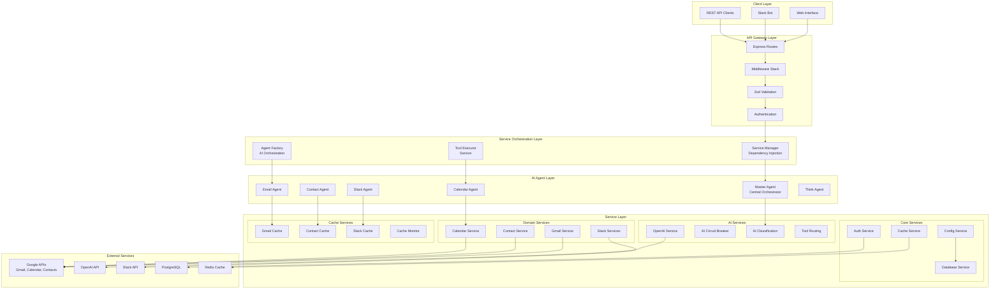
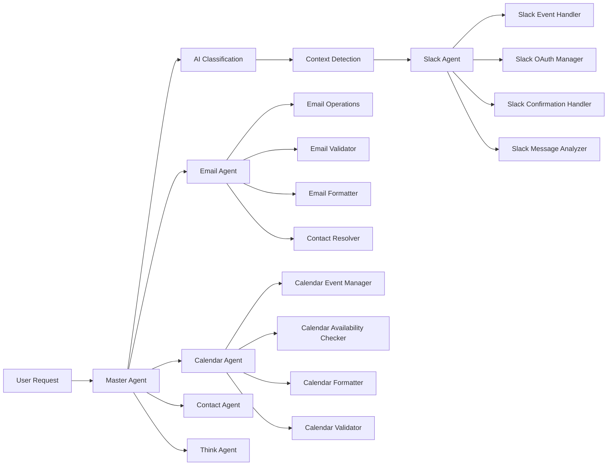
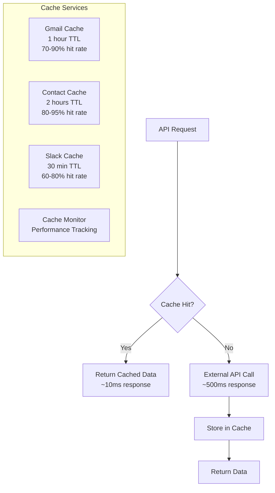
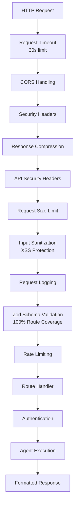

# System Architecture

The AI Assistant Platform implements a sophisticated **service-oriented architecture** with **AI-first design principles**, built for production scalability and maintainability.

## 🏗️ **High-Level Architecture**



## 🎯 **Core Architectural Principles**

### **1. Service-Oriented Architecture (SOA)**

The platform implements a sophisticated SOA pattern with:

- **Service Manager**: Central dependency injection container managing 26+ services
- **Dependency Resolution**: Automatic topological sorting for initialization order
- **Lifecycle Management**: Complete service lifecycle with health monitoring
- **Graceful Shutdown**: Reverse-order shutdown with proper cleanup

**Service Hierarchy:**
```
Priority 1-10:   Infrastructure Services (Config, Database, Cache)
Priority 10-25:  Authentication & Session Services
Priority 20-35:  Domain Services (Gmail, Calendar, Contacts)
Priority 15-18:  AI Services (OpenAI, Classification, Routing)
Priority 70-97:  Slack Services (Event Handling, OAuth, Confirmation)
Priority 85-88:  Email Services (Operations, Validation, Formatting)
Priority 90-93:  Calendar Services (Event Management, Availability)
Priority 98-101: Cache Services (Gmail, Contact, Slack, Monitoring)
```

### **2. AI-First Multi-Agent System**

The platform implements intelligent AI orchestration:



**AI Planning Flow:**
1. **Intent Classification**: AI determines user intent from natural language
2. **Context Detection**: Determines if Slack context is needed
3. **Plan Generation**: Creates step-by-step execution plan
4. **Tool Selection**: Selects appropriate agents and tools
5. **Parallel Execution**: Executes independent steps concurrently
6. **Result Synthesis**: Combines results into user-friendly response

### **3. Intelligent Caching System**

The platform implements sophisticated caching strategies:



**Cache Performance:**
- **Gmail API**: 70-90% hit rate, 1 hour TTL
- **Contact Resolution**: 80-95% hit rate, 2 hours TTL
- **Slack Messages**: 60-80% hit rate, 30 minutes TTL
- **Performance Impact**: 95% faster response times for cached operations

### **4. Request Processing Pipeline**



## 🔧 **Key Architectural Patterns**

### **Dependency Injection**
- **Service Manager**: Central container managing all services
- **Automatic Resolution**: Services initialized in dependency order
- **Lifecycle Management**: Proper initialization and cleanup
- **Health Monitoring**: Service health status tracking

### **AI Planning & Orchestration**
- **Intent Classification**: AI-powered request understanding
- **Context Detection**: Smart context gathering from Slack
- **Tool Generation**: AI-driven tool call creation
- **Result Synthesis**: Natural language response generation

### **Caching Strategy**
- **Cache-First**: Check cache before external API calls
- **Intelligent TTL**: Domain-specific cache expiration
- **Performance Monitoring**: Real-time cache metrics
- **Graceful Degradation**: Fallback to direct API calls

### **Error Handling**
- **Circuit Breaker**: AI service failure protection
- **Graceful Degradation**: Fallback mechanisms
- **Comprehensive Logging**: Structured error tracking
- **User-Friendly Messages**: Clear error communication

## 📊 **System Characteristics**

### **Scalability**
- **Stateless Services**: Horizontal scaling capability
- **Connection Pooling**: Efficient database connections
- **Caching**: Reduced external API load
- **Async Processing**: Non-blocking operations

### **Reliability**
- **Health Monitoring**: Service health tracking
- **Graceful Shutdown**: Proper cleanup on termination
- **Error Recovery**: Automatic retry mechanisms
- **Circuit Breakers**: Failure isolation

### **Security**
- **OAuth 2.0**: Secure authentication
- **JWT Tokens**: Stateless session management
- **Input Validation**: Zod schema validation
- **Rate Limiting**: API abuse prevention
- **XSS Protection**: Input sanitization

### **Performance**
- **Intelligent Caching**: 70-90% hit rates
- **Connection Pooling**: Efficient resource usage
- **Async Operations**: Non-blocking processing
- **Memory Optimization**: Service lifecycle management

## 🚀 **Deployment Architecture**

The platform is designed for **Railway deployment** with:

- **Containerized Services**: Docker-based deployment
- **Environment Configuration**: Secure secret management
- **Health Monitoring**: Production health checks
- **Log Aggregation**: Centralized logging
- **Auto-scaling**: Railway's automatic scaling

---

**Next**: [Service Architecture](./service-architecture.md) - Detailed service design and dependencies
