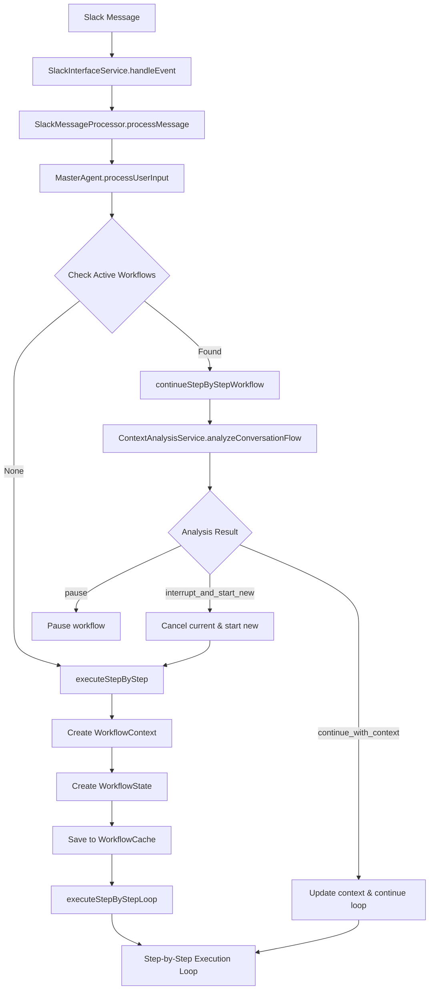
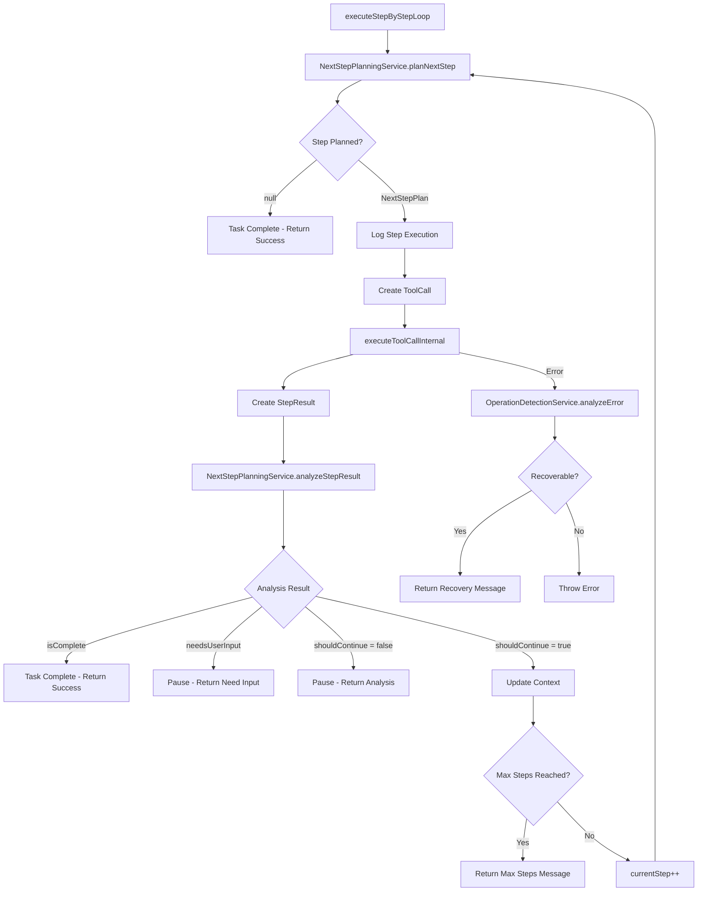
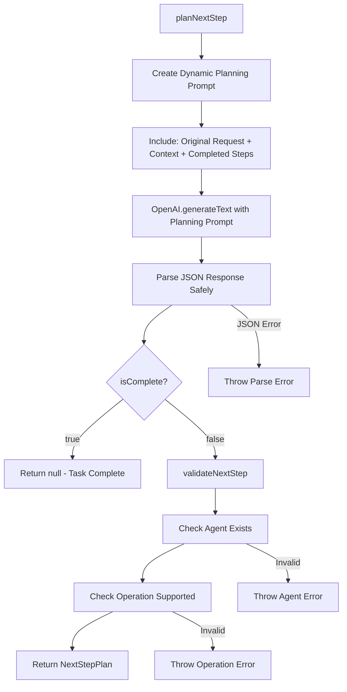
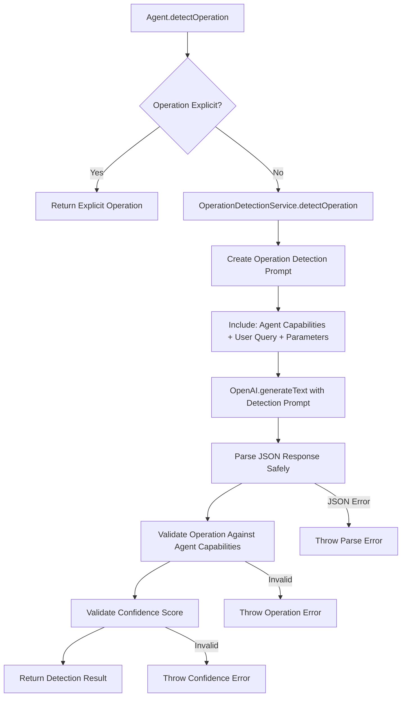

# 🌊 **Step-by-Step Workflow Flow Documentation**

## **🎯 Overview**
The enhanced agentic system now uses intelligent step-by-step execution instead of upfront planning. Each step is planned dynamically based on context and previous results, enabling Cursor-like adaptive intelligence.

---

## **🚀 COMPLETE WORKFLOW FLOW**

### **1. Initial Request Flow**


### **2. Step-by-Step Execution Loop**


### **3. Next Step Planning Process**


### **4. Operation Detection Process**


---

## **🔧 KEY COMPONENTS**

### **NextStepPlanningService**
**Purpose**: Plans one step at a time using LLM intelligence

**Key Methods:**
- `planNextStep(context: WorkflowContext): Promise<NextStepPlan | null>`
- `analyzeStepResult(result: StepResult, context: WorkflowContext)`

**Workflow Context:**
```typescript
interface WorkflowContext {
  originalRequest: string;
  currentStep: number;
  maxSteps: number;
  completedSteps: StepResult[];
  gatheredData: Record<string, any>;
  userContext?: any;
}
```

**Next Step Plan:**
```typescript
interface NextStepPlan {
  stepNumber: number;
  description: string;
  agent: string;
  operation: string;
  parameters: Record<string, any>;
  reasoning: string;
  isComplete: boolean;
}
```

### **OperationDetectionService**
**Purpose**: Replaces all hard string matching with LLM analysis

**Key Methods:**
- `detectOperation(agentName, userQuery, parameters, context?)`
- `analyzeError(error, context)`

**Supported Agents:**
- emailAgent: search, send, read, compose, reply, forward, delete
- calendarAgent: search, create, update, delete, check_availability, suggest_times
- contactAgent: search, create, update, delete, resolve
- slackAgent: send_message, gather_context, search, analyze
- thinkAgent: analyze, reason, summarize, compare, recommend

### **MasterAgent Methods**
**New Methods:**
- `executeStepByStep()` - Main step-by-step execution
- `continueStepByStepWorkflow()` - Handle workflow continuations
- `executeStepByStepLoop()` - Core execution loop

**Legacy Methods (Preserved):**
- `processUserInputLegacy()` - Original implementation for reference

---

## **📊 WORKFLOW STATE MANAGEMENT**

### **WorkflowState (Redis Cached)**
```typescript
interface WorkflowState {
  workflowId: string;
  sessionId: string;
  userId?: string;
  status: 'active' | 'paused' | 'completed' | 'cancelled';
  currentStep: number;
  totalSteps: number;
  plan: WorkflowStep[]; // Empty for step-by-step (planned dynamically)
  completedSteps: WorkflowStep[];
  pendingStep: WorkflowStep | null;
  context: {
    originalRequest: string;
    userIntent: string;
    gatheredData: Record<string, any>;
  };
  createdAt: Date;
  lastActivity: Date;
  expiresAt: Date;
}
```

### **Step Result Tracking**
```typescript
interface StepResult {
  stepNumber: number;
  agent: string;
  operation: string;
  parameters: Record<string, any>;
  result: any;
  success: boolean;
  error?: string;
  executedAt: Date;
}
```

---

## **🌊 EXECUTION FLOW EXAMPLES**

### **Example 1: Simple Email Search**
```
User: "Search my emails for project updates"

Flow:
1. planNextStep() → LLM decides: emailAgent.search with query="project updates"
2. executeStep() → EmailAgent.search() → Returns 5 emails
3. analyzeStepResult() → LLM decides: Task complete, user has results
4. Return: Success with email results
```

### **Example 2: Multi-Step Workflow**
```
User: "Find budget meeting emails and create follow-up calendar event"

Flow:
1. planNextStep() → emailAgent.search with query="budget meeting"
2. executeStep() → Returns 3 emails about budget meeting
3. analyzeStepResult() → LLM decides: Continue, need to create calendar event
4. planNextStep() → calendarAgent.create with extracted meeting details
5. executeStep() → Creates calendar event
6. analyzeStepResult() → LLM decides: Task complete
7. Return: Success with both email results and calendar event
```

### **Example 3: Workflow Interruption**
```
User starts: "Find all unread emails"
1. planNextStep() → emailAgent.search with query="is:unread"
2. executeStep() → In progress...

User interrupts: "Actually, check my calendar instead"
1. continueStepByStepWorkflow() triggered
2. ContextAnalysisService analyzes: "interrupt_and_start_new"
3. Cancel current workflow
4. Start new: executeStepByStep() with "check my calendar"
```

---

## **🚀 INTELLIGENCE FEATURES**

### **Dynamic Adaptation**
- Each step planned based on previous results
- No rigid templates or predefined workflows
- LLM reasoning at every decision point
- Context accumulates and informs future decisions

### **Intelligent Completion Detection**
- LLM determines when tasks are complete
- Natural workflow termination
- No forced completion or timeouts
- User satisfaction prioritized

### **Error Recovery**
- LLM analyzes errors and suggests recovery
- Categorizes errors (authentication, network, validation, etc.)
- Provides user-friendly explanations
- Actionable next steps

### **Conversation Continuity**
- Handles interruptions naturally
- Maintains context across multiple turns
- Seamless transition between workflows
- User intent prioritized over system state

---

## **🎯 SUCCESS INDICATORS**

### **For Step Planning:**
- Each step has clear description and reasoning
- Agent and operation selections are appropriate
- Parameters extracted correctly from context
- Completion detection works naturally

### **For Execution:**
- Steps execute successfully
- Results are properly captured and analyzed
- Context accumulates meaningful data
- Error handling provides clear guidance

### **For User Experience:**
- Natural conversation flow
- Interruptions handled gracefully
- Clear progress communication
- Appropriate completion messaging

---

## **📈 MONITORING & DEBUGGING**

### **Log Markers:**
- `next-step-planned` - Step planning completed
- `step-execution` - Step execution started
- `step-analysis` - Step result analysis
- `workflow-complete` - Natural completion
- `workflow-interrupted` - User interruption

### **Key Metrics:**
- Average steps per workflow
- Completion rate vs. interruption rate
- Step execution success rate
- User satisfaction with results

### **Debugging Tools:**
- Correlation IDs for tracing workflows
- Detailed step reasoning in logs
- Context accumulation tracking
- Error categorization and recovery tracking

This step-by-step workflow system represents a fundamental shift from rigid, template-based automation to intelligent, adaptive assistance that works more like a human thinking through problems step by step.