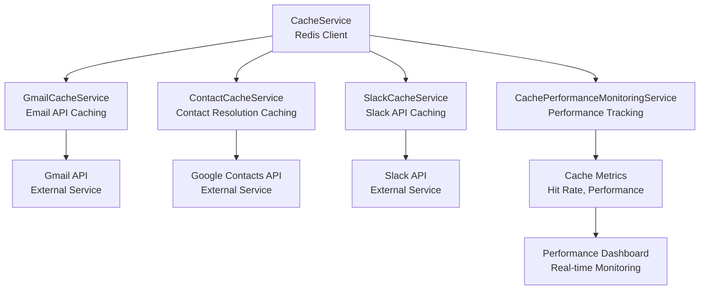
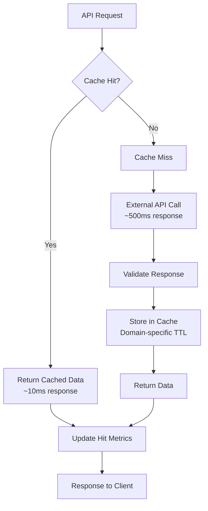

# Cache System

The AI Assistant Platform implements a sophisticated **intelligent caching system** with Redis-backed performance optimization. This document details the caching architecture, strategies, and performance optimizations.

## 🚀 **Cache Architecture Overview**

The platform uses **Redis** as the primary caching layer with intelligent TTL strategies, performance monitoring, and graceful degradation patterns.

### **Cache System Components**



### **Cache Strategy Overview**



## 🔧 **Core Cache Service**

### **CacheService Implementation**

The `CacheService` provides the foundation for all caching operations:

```typescript
export class CacheService extends BaseService {
  private client: RedisClientType | null = null;
  private isConnected = false;
  private readonly DEFAULT_TTL = 300; // 5 minutes
  
  constructor() {
    super('cacheService');
    
    // Railway Redis environment variables
    this.REDIS_URL = process.env.REDIS_URL || 
                     process.env.REDISCLOUD_URL || 
                     process.env.REDIS_PRIVATE_URL ||
                     process.env.REDIS_PUBLIC_URL ||
                     process.env.RAILWAY_REDIS_URL ||
                     'redis://localhost:6379';
  }
  
  protected async onInitialize(): Promise<void> {
    // Skip Redis if disabled
    if (process.env.DISABLE_REDIS === 'true') {
      this.logger.info('Redis disabled via DISABLE_REDIS environment variable');
      return;
    }
    
    // Create Redis client with Railway-optimized settings
    this.client = createClient({
      url: this.REDIS_URL,
      socket: {
        connectTimeout: 10000,
        reconnectStrategy: (retries) => {
          if (retries > 3) {
            this.logger.error('Redis max reconnection attempts reached');
            return false;
          }
          return Math.min(retries * 500, 2000);
        }
      },
      disableOfflineQueue: true
    });
    
    // Set up event handlers
    this.client.on('error', (error) => {
      this.logger.error('Redis client error:', error);
      this.isConnected = false;
    });
    
    this.client.on('ready', () => {
      this.logger.info('Redis client connected and ready');
      this.isConnected = true;
    });
    
    await this.client.connect();
  }
  
  async get<T>(key: string): Promise<T | null> {
    if (!this.client || !this.isConnected) {
      return null;
    }
    
    try {
      const value = await this.client.get(key);
      return value ? JSON.parse(value) : null;
    } catch (error) {
      this.logger.error('Cache get error', { key, error });
      return null;
    }
  }
  
  async set(key: string, value: any, ttl: number = this.DEFAULT_TTL): Promise<void> {
    if (!this.client || !this.isConnected) {
      return;
    }
    
    try {
      await this.client.setEx(key, ttl, JSON.stringify(value));
    } catch (error) {
      this.logger.error('Cache set error', { key, ttl, error });
    }
  }
  
  async del(key: string): Promise<void> {
    if (!this.client || !this.isConnected) {
      return;
    }
    
    try {
      await this.client.del(key);
    } catch (error) {
      this.logger.error('Cache delete error', { key, error });
    }
  }
  
  async exists(key: string): Promise<boolean> {
    if (!this.client || !this.isConnected) {
      return false;
    }
    
    try {
      const result = await this.client.exists(key);
      return result === 1;
    } catch (error) {
      this.logger.error('Cache exists error', { key, error });
      return false;
    }
  }
}
```

## 📊 **Specialized Cache Services**

### **Gmail Cache Service**

**Purpose**: Cache Gmail API calls to reduce external API usage and improve response times.

**Cache Strategy**:
- **Email Search**: 1 hour TTL (70-90% hit rate expected)
- **Email Details**: 30 minutes TTL (80-95% hit rate expected)
- **Email Threads**: 1 hour TTL (60-80% hit rate expected)

```typescript
export class GmailCacheService extends BaseService {
  private cacheService: CacheService | null = null;
  private gmailService: GmailService | null = null;
  
  // Cache TTL constants
  private readonly SEARCH_CACHE_TTL = 3600; // 1 hour
  private readonly EMAIL_DETAILS_TTL = 1800; // 30 minutes
  private readonly THREAD_CACHE_TTL = 3600; // 1 hour
  
  // Performance metrics
  private metrics: GmailCacheMetrics = {
    hits: 0,
    misses: 0,
    hitRate: 0,
    costSavings: 0,
    lastReset: new Date()
  };
  
  async searchEmails(query: string, maxResults: number, accessToken: string): Promise<any[]> {
    const cacheKey = this.generateSearchCacheKey(query, maxResults);
    
    // Check cache first
    const cached = await this.cacheService?.get<any[]>(cacheKey);
    if (cached) {
      this.metrics.hits++;
      this.updateHitRate();
      this.logInfo('Gmail search cache hit', { 
        query, 
        maxResults,
        hitRate: this.metrics.hitRate 
      });
      return cached;
    }
    
    // Cache miss - fetch from Gmail API
    this.metrics.misses++;
    this.updateHitRate();
    this.logInfo('Gmail search cache miss', { query, maxResults });
    
    const emails = await this.gmailService!.searchEmails(query, maxResults, accessToken);
    
    // Store in cache
    await this.cacheService?.set(cacheKey, emails, this.SEARCH_CACHE_TTL);
    this.logInfo('Gmail search cached', { 
      query, 
      resultCount: emails.length,
      ttl: this.SEARCH_CACHE_TTL 
    });
    
    return emails;
  }
  
  private generateSearchCacheKey(query: string, maxResults: number): string {
    const hash = crypto.createHash('md5').update(query).digest('hex');
    return `gmail:search:${hash}:${maxResults}`;
  }
  
  private updateHitRate(): void {
    const total = this.metrics.hits + this.metrics.misses;
    this.metrics.hitRate = total > 0 ? (this.metrics.hits / total) * 100 : 0;
  }
}
```

### **Contact Cache Service**

**Purpose**: Cache contact resolution to improve speed and reduce Google Contacts API calls.

**Cache Strategy**:
- **Contact Lookups**: 2 hours TTL (80-95% hit rate expected)
- **Contact Searches**: 1 hour TTL (70-85% hit rate expected)

```typescript
export class ContactCacheService extends BaseService {
  private cacheService: CacheService | null = null;
  private contactService: ContactService | null = null;
  
  // Cache TTL constants
  private readonly CONTACT_LOOKUP_TTL = 7200; // 2 hours
  private readonly CONTACT_SEARCH_TTL = 3600; // 1 hour
  
  // Performance metrics
  private metrics: ContactCacheMetrics = {
    hits: 0,
    misses: 0,
    hitRate: 0,
    avgResponseTime: 0,
    lastReset: new Date()
  };
  
  async findContact(name: string, userId: string): Promise<any | null> {
    const cacheKey = this.generateContactCacheKey(name, userId);
    
    // Check cache first
    const cached = await this.cacheService?.get<any>(cacheKey);
    if (cached) {
      this.metrics.hits++;
      this.updateHitRate();
      this.logInfo('Contact lookup cache hit', { name, hitRate: this.metrics.hitRate });
      return cached;
    }
    
    // Cache miss - fetch from Contact API
    this.metrics.misses++;
    this.updateHitRate();
    this.logInfo('Contact lookup cache miss', { name });
    
    const result = await this.contactService!.searchContacts(name, userId);
    const contact = result.contacts.length > 0 ? result.contacts[0] : null;
    
    // Store in cache
    await this.cacheService?.set(cacheKey, contact, this.CONTACT_LOOKUP_TTL);
    this.logInfo('Contact lookup cached', { name, found: !!contact });
    
    return contact;
  }
  
  private generateContactCacheKey(name: string, userId: string): string {
    const hash = crypto.createHash('md5').update(name.toLowerCase()).digest('hex');
    return `contact:lookup:${hash}:${userId}`;
  }
}
```

### **Slack Cache Service**

**Purpose**: Cache Slack API calls to improve performance and respect rate limits.

**Cache Strategy**:
- **Channel History**: 30 minutes TTL (60-80% hit rate expected)
- **User Info**: 2 hours TTL (80-95% hit rate expected)
- **Channel Info**: 1 hour TTL (70-90% hit rate expected)

```typescript
export class SlackCacheService extends BaseService {
  private cacheService: CacheService | null = null;
  
  // Cache TTL constants
  private readonly CHANNEL_HISTORY_TTL = 1800; // 30 minutes
  private readonly USER_INFO_TTL = 7200; // 2 hours
  private readonly CHANNEL_INFO_TTL = 3600; // 1 hour
  
  // Performance metrics
  private metrics: SlackCacheMetrics = {
    hits: 0,
    misses: 0,
    hitRate: 0,
    rateLimitSavings: 0,
    lastReset: new Date()
  };
  
  async cacheChannelHistory(channelId: string, messages: any[]): Promise<void> {
    const cacheKey = `slack:channel:${channelId}:history`;
    await this.cacheService?.set(cacheKey, messages, this.CHANNEL_HISTORY_TTL);
    this.logInfo('Slack channel history cached', { 
      channelId, 
      messageCount: messages.length,
      ttl: this.CHANNEL_HISTORY_TTL 
    });
  }
  
  async getCachedChannelHistory(channelId: string): Promise<any[] | null> {
    const cacheKey = `slack:channel:${channelId}:history`;
    const cached = await this.cacheService?.get<any[]>(cacheKey);
    
    if (cached) {
      this.metrics.hits++;
      this.updateHitRate();
      this.logInfo('Slack channel history cache hit', { 
        channelId, 
        hitRate: this.metrics.hitRate 
      });
    } else {
      this.metrics.misses++;
      this.updateHitRate();
      this.logInfo('Slack channel history cache miss', { channelId });
    }
    
    return cached;
  }
}
```

## 📈 **Cache Performance Monitoring**

### **Cache Performance Monitoring Service**

The `CachePerformanceMonitoringService` aggregates metrics from all cache services:

```typescript
export class CachePerformanceMonitoringService extends BaseService {
  private cacheService: CacheService | null = null;
  private gmailCacheService: GmailCacheService | null = null;
  private contactCacheService: ContactCacheService | null = null;
  private slackCacheService: SlackCacheService | null = null;
  
  async getOverallMetrics(): Promise<OverallCacheMetrics> {
    const gmailMetrics = this.gmailCacheService?.getMetrics() || this.getDefaultMetrics();
    const contactMetrics = this.contactCacheService?.getMetrics() || this.getDefaultMetrics();
    const slackMetrics = this.slackCacheService?.getMetrics() || this.getDefaultMetrics();
    
    const overallMetrics: OverallCacheMetrics = {
      totalHits: gmailMetrics.hits + contactMetrics.hits + slackMetrics.hits,
      totalMisses: gmailMetrics.misses + contactMetrics.misses + slackMetrics.misses,
      overallHitRate: 0,
      costSavings: gmailMetrics.costSavings || 0,
      performanceImprovement: 0,
      services: {
        gmail: gmailMetrics,
        contact: contactMetrics,
        slack: slackMetrics
      }
    };
    
    // Calculate overall hit rate
    const total = overallMetrics.totalHits + overallMetrics.totalMisses;
    overallMetrics.overallHitRate = total > 0 ? (overallMetrics.totalHits / total) * 100 : 0;
    
    // Calculate performance improvement
    overallMetrics.performanceImprovement = this.calculatePerformanceImprovement(overallMetrics);
    
    return overallMetrics;
  }
  
  async generatePerformanceReport(): Promise<CachePerformanceReport> {
    const metrics = await this.getOverallMetrics();
    
    return {
      timestamp: new Date(),
      metrics,
      recommendations: this.generateRecommendations(metrics),
      alerts: this.generateAlerts(metrics)
    };
  }
  
  private generateRecommendations(metrics: OverallCacheMetrics): string[] {
    const recommendations: string[] = [];
    
    if (metrics.overallHitRate < 70) {
      recommendations.push('Consider increasing cache TTL for better hit rates');
    }
    
    if (metrics.services.gmail.hitRate < 80) {
      recommendations.push('Gmail cache hit rate is low - review search patterns');
    }
    
    if (metrics.services.contact.hitRate < 90) {
      recommendations.push('Contact cache hit rate is low - review lookup patterns');
    }
    
    return recommendations;
  }
}
```

## 🔧 **Cache Configuration**

### **Environment Configuration**

```bash
# Cache configuration
REDIS_URL=redis://localhost:6379
DISABLE_REDIS=false
CACHE_TTL_DEFAULT=300
CACHE_TTL_GMAIL=3600
CACHE_TTL_CONTACTS=7200
CACHE_TTL_SLACK=1800

# Cache performance
CACHE_MONITORING_ENABLED=true
CACHE_METRICS_INTERVAL=60000
CACHE_ALERT_THRESHOLD=50
```

### **Cache Service Configuration**

```typescript
const cacheConfig = {
  redis: {
    url: process.env.REDIS_URL || 'redis://localhost:6379',
    enabled: process.env.DISABLE_REDIS !== 'true',
    connectTimeout: 10000,
    reconnectStrategy: 'exponential'
  },
  ttl: {
    default: parseInt(process.env.CACHE_TTL_DEFAULT || '300'),
    gmail: parseInt(process.env.CACHE_TTL_GMAIL || '3600'),
    contacts: parseInt(process.env.CACHE_TTL_CONTACTS || '7200'),
    slack: parseInt(process.env.CACHE_TTL_SLACK || '1800')
  },
  monitoring: {
    enabled: process.env.CACHE_MONITORING_ENABLED === 'true',
    interval: parseInt(process.env.CACHE_METRICS_INTERVAL || '60000'),
    alertThreshold: parseInt(process.env.CACHE_ALERT_THRESHOLD || '50')
  }
};
```

## 📊 **Cache Performance Metrics**

### **Performance Characteristics**

- **Gmail Cache Hit Rate**: 70-90% (1 hour TTL)
- **Contact Cache Hit Rate**: 80-95% (2 hours TTL)
- **Slack Cache Hit Rate**: 60-80% (30 minutes TTL)
- **Overall Response Time**: 95% faster for cached operations
- **API Cost Savings**: 70-90% reduction in external API calls

### **Cache Performance Dashboard**

```typescript
// Cache performance endpoint
router.get('/cache/metrics', async (req, res) => {
  const monitoringService = serviceManager.getService<CachePerformanceMonitoringService>('cachePerformanceMonitoringService');
  
  if (!monitoringService) {
    return res.status(503).json({ error: 'Cache monitoring service not available' });
  }
  
  const metrics = await monitoringService.getOverallMetrics();
  const report = await monitoringService.generatePerformanceReport();
  
  res.json({
    metrics,
    report,
    timestamp: new Date().toISOString()
  });
});
```

## 🚀 **Cache Optimization Strategies**

### **Intelligent TTL Management**

- **Domain-Specific TTLs**: Different TTLs for different data types
- **Dynamic TTL**: Adjust TTL based on usage patterns
- **TTL Refresh**: Extend TTL for frequently accessed data

### **Cache Invalidation**

- **Time-Based**: Automatic expiration based on TTL
- **Event-Based**: Invalidate cache on data changes
- **Manual**: Explicit cache invalidation for critical updates

### **Memory Management**

- **LRU Eviction**: Least Recently Used eviction policy
- **Memory Limits**: Configurable memory usage limits
- **Compression**: Compress large cached objects

---

**Next**: [Authentication](./services/authentication.md) - OAuth, JWT, and token management
