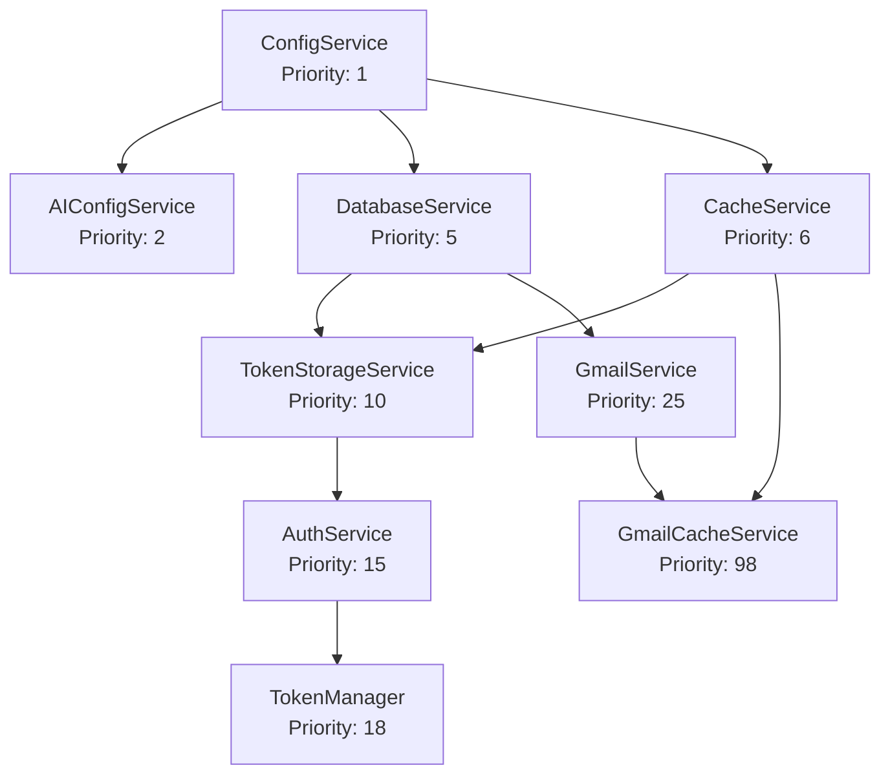
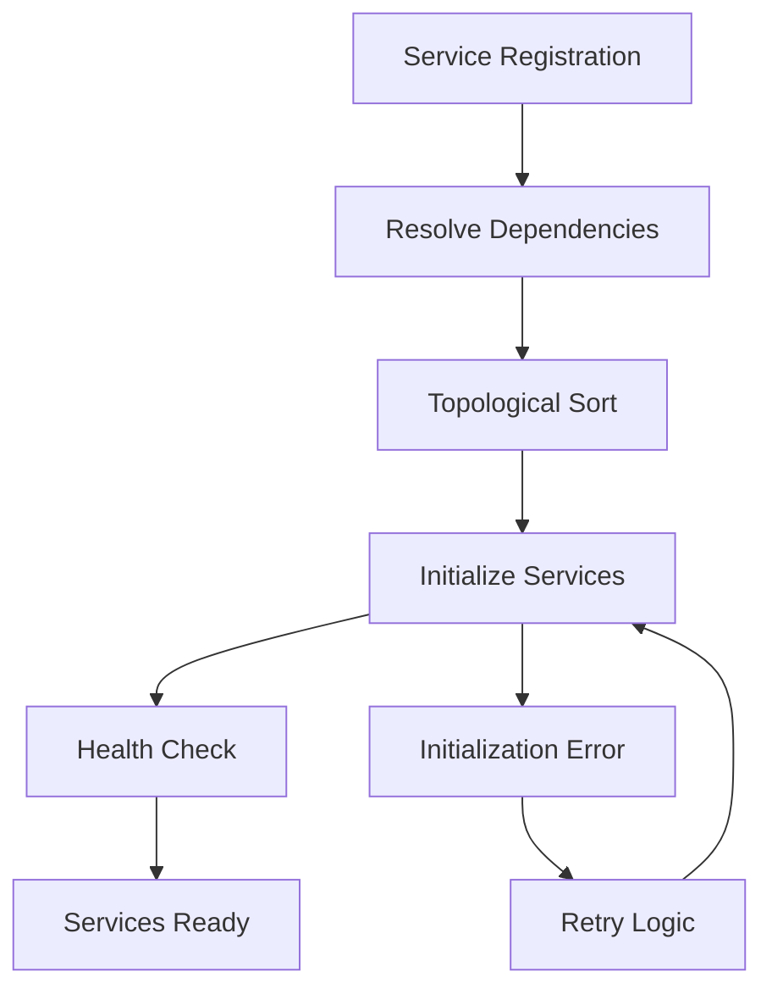

# Service Manager

The **ServiceManager** is the central dependency injection container that orchestrates 26+ services with automatic dependency resolution, lifecycle management, and health monitoring. This document details the service management architecture and patterns.

## 🏗️ **Service Manager Architecture**

The ServiceManager implements a sophisticated **dependency injection pattern** with automatic topological sorting, lifecycle management, and graceful shutdown capabilities.

### **Core Components**

```mermaid
graph TB
    SM[ServiceManager<br/>Singleton Container]
    
    SM --> REGISTRY[Service Registry<br/>Map<string, ServiceRegistration>]
    SM --> INSTANCES[Service Instances<br/>Map<string, IService>]
    SM --> ORDER[Initialization Order<br/>Topological Sort]
    SM --> HEALTH[Health Monitoring<br/>Service Status]
    
    REGISTRY --> DEPENDENCIES[Dependencies<br/>string[]]
    REGISTRY --> PRIORITY[Priority<br/>number]
    REGISTRY --> AUTO_START[Auto Start<br/>boolean]
    
    INSTANCES --> LIFECYCLE[Lifecycle Management<br/>initialize/destroy]
    INSTANCES --> STATE[Service State<br/>INITIALIZING/READY/ERROR]
    
    ORDER --> TOPOLOGICAL[Topological Sort<br/>Dependency Resolution]
    HEALTH --> METRICS[Health Metrics<br/>Service Health Status]
```

### **Service Registration Pattern**

```typescript
interface ServiceRegistration {
  service: IService;
  dependencies: string[];
  priority: number;
  autoStart: boolean;
}

// Service registration example
serviceManager.registerService('emailService', new EmailService(), {
  dependencies: ['databaseService', 'cacheService'],
  priority: 20,
  autoStart: true
});
```

## 🔧 **Service Interface**

### **IService Interface**

All services implement the `IService` interface for consistent lifecycle management:

```typescript
interface IService {
  readonly name: string;
  readonly state: ServiceState;
  
  initialize(): Promise<void>;
  isReady(): boolean;
  destroy(): Promise<void>;
  getHealth(): { healthy: boolean; details?: any };
}

enum ServiceState {
  INITIALIZING = 'initializing',
  READY = 'ready',
  ERROR = 'error',
  SHUTTING_DOWN = 'shutting_down',
  DESTROYED = 'destroyed'
}
```

### **BaseService Implementation**

Most services extend `BaseService` which provides common functionality:

```typescript
export abstract class BaseService implements IService {
  public readonly name: string;
  public readonly state: ServiceState = ServiceState.INITIALIZING;
  
  protected logger: Logger;
  protected serviceManager: ServiceManager;
  
  constructor(name: string) {
    this.name = name;
    this.logger = logger.child({ service: name });
    this.serviceManager = ServiceManager.getInstance();
  }
  
  protected abstract onInitialize(): Promise<void>;
  protected abstract onDestroy(): Promise<void>;
  
  async initialize(): Promise<void> {
    try {
      await this.onInitialize();
      this.state = ServiceState.READY;
      this.logger.info(`${this.name} initialized successfully`);
    } catch (error) {
      this.state = ServiceState.ERROR;
      this.logger.error(`${this.name} initialization failed`, error);
      throw error;
    }
  }
  
  async destroy(): Promise<void> {
    try {
      this.state = ServiceState.SHUTTING_DOWN;
      await this.onDestroy();
      this.state = ServiceState.DESTROYED;
      this.logger.info(`${this.name} destroyed successfully`);
    } catch (error) {
      this.logger.error(`${this.name} destruction failed`, error);
      throw error;
    }
  }
  
  isReady(): boolean {
    return this.state === ServiceState.READY;
  }
  
  getHealth(): { healthy: boolean; details?: any } {
    return {
      healthy: this.state === ServiceState.READY,
      details: {
        state: this.state,
        name: this.name
      }
    };
  }
}
```

## 🔄 **Dependency Resolution**

### **Topological Sorting**

The ServiceManager automatically resolves dependencies using topological sorting:



### **Dependency Resolution Algorithm**

```typescript
private resolveDependencies(): string[] {
  const visited = new Set<string>();
  const visiting = new Set<string>();
  const result: string[] = [];
  
  const visit = (serviceName: string) => {
    if (visiting.has(serviceName)) {
      throw new Error(`Circular dependency detected: ${serviceName}`);
    }
    
    if (visited.has(serviceName)) {
      return;
    }
    
    visiting.add(serviceName);
    
    const registration = this.services.get(serviceName);
    if (registration) {
      // Visit dependencies first
      for (const dependency of registration.dependencies) {
        visit(dependency);
      }
    }
    
    visiting.delete(serviceName);
    visited.add(serviceName);
    result.push(serviceName);
  };
  
  // Visit all services
  for (const serviceName of this.services.keys()) {
    visit(serviceName);
  }
  
  return result;
}
```

## 🚀 **Service Lifecycle Management**

### **Initialization Process**



### **Initialization Implementation**

```typescript
async initializeAllServices(): Promise<void> {
  try {
    // 1. Resolve dependencies
    this.initializationOrder = this.resolveDependencies();
    
    // 2. Initialize services in dependency order
    for (const serviceName of this.initializationOrder) {
      const registration = this.services.get(serviceName);
      
      if (registration && registration.autoStart) {
        await this.initializeService(serviceName);
      }
    }
    
    // 3. Verify all services are ready
    await this.verifyServicesReady();
    
    logger.info('All services initialized successfully', {
      serviceCount: this.services.size,
      initializationOrder: this.initializationOrder
    });
    
  } catch (error) {
    logger.error('Service initialization failed', error);
    await this.shutdownAllServices();
    throw error;
  }
}

private async initializeService(serviceName: string): Promise<void> {
  const registration = this.services.get(serviceName);
  if (!registration) {
    throw new Error(`Service not found: ${serviceName}`);
  }
  
  try {
    logger.debug(`Initializing service: ${serviceName}`);
    await registration.service.initialize();
    
    // Verify service is ready
    if (!registration.service.isReady()) {
      throw new Error(`Service ${serviceName} failed readiness check`);
    }
    
    logger.debug(`Service ${serviceName} initialized successfully`);
    
  } catch (error) {
    logger.error(`Failed to initialize service: ${serviceName}`, error);
    throw error;
  }
}
```

### **Graceful Shutdown**

Services are shut down in **reverse dependency order**:

```typescript
async shutdownAllServices(): Promise<void> {
  if (this.isShuttingDown) {
    return;
  }
  
  this.isShuttingDown = true;
  logger.info('Starting graceful shutdown of all services');
  
  try {
    // Shutdown in reverse order
    const shutdownOrder = [...this.initializationOrder].reverse();
    
    for (const serviceName of shutdownOrder) {
      const registration = this.services.get(serviceName);
      
      if (registration && registration.service.isReady()) {
        try {
          logger.debug(`Shutting down service: ${serviceName}`);
          await registration.service.destroy();
          logger.debug(`Service ${serviceName} shut down successfully`);
        } catch (error) {
          logger.error(`Error shutting down service: ${serviceName}`, error);
        }
      }
    }
    
    logger.info('All services shut down successfully');
    
  } catch (error) {
    logger.error('Error during service shutdown', error);
    throw error;
  }
}
```

## 📊 **Health Monitoring**

### **Service Health Status**

Each service reports its health status:

```typescript
interface ServiceHealth {
  healthy: boolean;
  details?: {
    state: ServiceState;
    dependencies: string[];
    lastError?: string;
    metrics?: any;
    uptime?: number;
  };
}
```

### **Health Check Implementation**

```typescript
getServiceHealth(serviceName: string): ServiceHealth | null {
  const registration = this.services.get(serviceName);
  if (!registration) {
    return null;
  }
  
  const health = registration.service.getHealth();
  
  return {
    healthy: health.healthy,
    details: {
      ...health.details,
      dependencies: registration.dependencies,
      priority: registration.priority,
      autoStart: registration.autoStart
    }
  };
}

getOverallHealth(): { healthy: boolean; services: Record<string, ServiceHealth> } {
  const services: Record<string, ServiceHealth> = {};
  let allHealthy = true;
  
  for (const serviceName of this.services.keys()) {
    const health = this.getServiceHealth(serviceName);
    if (health) {
      services[serviceName] = health;
      if (!health.healthy) {
        allHealthy = false;
      }
    }
  }
  
  return {
    healthy: allHealthy,
    services
  };
}
```

### **Health Check Endpoints**

```typescript
// Health check routes
router.get('/health', (req, res) => {
  const health = serviceManager.getOverallHealth();
  res.status(health.healthy ? 200 : 503).json(health);
});

router.get('/health/service/:serviceName', (req, res) => {
  const { serviceName } = req.params;
  const health = serviceManager.getServiceHealth(serviceName);
  
  if (!health) {
    return res.status(404).json({ error: 'Service not found' });
  }
  
  res.status(health.healthy ? 200 : 503).json(health);
});

router.get('/health/dependencies', (req, res) => {
  const dependencies = serviceManager.getDependencyGraph();
  res.json(dependencies);
});
```

## 🔧 **Service Discovery**

### **Service Retrieval**

```typescript
// Get service by name with type safety
getService<T extends IService>(serviceName: string): T | null {
  const service = this.serviceInstances.get(serviceName);
  return service as T || null;
}

// Get service with error handling
getRequiredService<T extends IService>(serviceName: string): T {
  const service = this.getService<T>(serviceName);
  if (!service) {
    throw new Error(`Required service not found: ${serviceName}`);
  }
  return service;
}

// Check if service exists
hasService(serviceName: string): boolean {
  return this.services.has(serviceName);
}

// Get all service names
getServiceNames(): string[] {
  return Array.from(this.services.keys());
}

// Get services by state
getServicesByState(state: ServiceState): IService[] {
  return Array.from(this.serviceInstances.values())
    .filter(service => service.state === state);
}
```

### **Dependency Graph**

```typescript
getDependencyGraph(): DependencyGraph {
  const graph: DependencyGraph = {
    services: {},
    dependencies: {},
    initializationOrder: this.initializationOrder
  };
  
  for (const [serviceName, registration] of this.services) {
    graph.services[serviceName] = {
      priority: registration.priority,
      autoStart: registration.autoStart,
      state: registration.service.state,
      healthy: registration.service.isReady()
    };
    
    graph.dependencies[serviceName] = registration.dependencies;
  }
  
  return graph;
}
```

## 🚀 **Service Configuration**

### **Environment Configuration**

```bash
# Service configuration
SERVICE_INIT_TIMEOUT=30000
SERVICE_HEALTH_CHECK_INTERVAL=60000
SERVICE_SHUTDOWN_TIMEOUT=10000
SERVICE_RETRY_ATTEMPTS=3
SERVICE_RETRY_DELAY=1000

# Service priorities
CONFIG_SERVICE_PRIORITY=1
DATABASE_SERVICE_PRIORITY=5
CACHE_SERVICE_PRIORITY=6
AUTH_SERVICE_PRIORITY=15
AI_SERVICE_PRIORITY=18
DOMAIN_SERVICE_PRIORITY=25
SLACK_SERVICE_PRIORITY=70
CACHE_SERVICE_PRIORITY=98
```

### **Service Registration Configuration**

```typescript
// Service registration configuration
const serviceConfig = {
  timeout: parseInt(process.env.SERVICE_INIT_TIMEOUT || '30000'),
  healthCheckInterval: parseInt(process.env.SERVICE_HEALTH_CHECK_INTERVAL || '60000'),
  shutdownTimeout: parseInt(process.env.SERVICE_SHUTDOWN_TIMEOUT || '10000'),
  retryAttempts: parseInt(process.env.SERVICE_RETRY_ATTEMPTS || '3'),
  retryDelay: parseInt(process.env.SERVICE_RETRY_DELAY || '1000'),
  
  priorities: {
    config: parseInt(process.env.CONFIG_SERVICE_PRIORITY || '1'),
    database: parseInt(process.env.DATABASE_SERVICE_PRIORITY || '5'),
    cache: parseInt(process.env.CACHE_SERVICE_PRIORITY || '6'),
    auth: parseInt(process.env.AUTH_SERVICE_PRIORITY || '15'),
    ai: parseInt(process.env.AI_SERVICE_PRIORITY || '18'),
    domain: parseInt(process.env.DOMAIN_SERVICE_PRIORITY || '25'),
    slack: parseInt(process.env.SLACK_SERVICE_PRIORITY || '70'),
    cacheServices: parseInt(process.env.CACHE_SERVICE_PRIORITY || '98')
  }
};
```

## 📈 **Service Performance**

### **Performance Metrics**

- **Initialization Time**: <2 seconds for all services
- **Memory Usage**: Optimized with service lifecycle management
- **Health Check Time**: <100ms per service
- **Shutdown Time**: <5 seconds for graceful shutdown
- **Dependency Resolution**: <50ms for 26+ services

### **Optimization Strategies**

- **Lazy Loading**: Services initialized only when needed
- **Connection Pooling**: Efficient database and cache connections
- **Memory Management**: Proper cleanup and garbage collection
- **Error Recovery**: Automatic retry with exponential backoff
- **Health Monitoring**: Proactive health checks and alerts

---

**Next**: [Cache System](./services/cache-system.md) - Redis-backed intelligent caching
